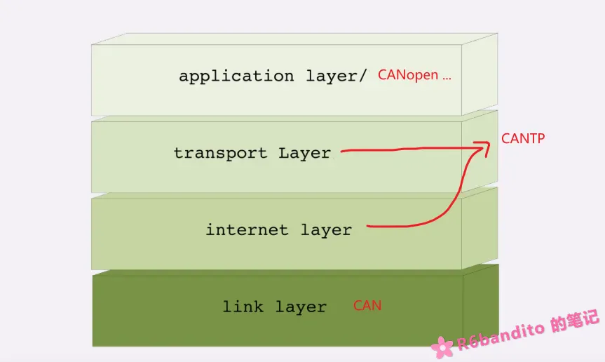

### 什么是CANTP

CANTP 全称 Controller Area Network **Transport Layer**，也就是 CAN 传输层，是一种在CAN总线基础上实现的传输协议。Classic CAN 报文一帧最大也就携带8字节数据，就算是加强版的 CAN FD 一帧最大也只能携带64字节数据。因此若需要传输大数据，就需要一个可靠的传输协议，而 CANTP 也正是为此设计的。

CANTP 是一个统称，根据标准不同，有着不同的实现：例如 SAE J1939-21 标准(商用车/重型车辆领域)，以及更通用的 ISO15765-2 ，本文的 CANTP 也是指基于 ISO 15765-2 标准的实现（也叫 iso-tp）。

### 为什么需要CANTP

- **CAN报文负载限制**：标准CAN帧（CAN 2.0A/B）的数据场最多只能携带8字节。但在很多实际应用（如汽车诊断、ECU刷写、仪表显示大数据等）中，需要传输几十甚至几百字节的数据。必须有一个稳定可靠的协议，来指导将长数据分割成多个短帧发送，并在接收端正确重组。
- **保证数据可靠传输**：光能够把数据正确发出与重组还不够，通信双方还必须考虑一个合理的通信节奏。不能够太快（接收方处理不过来，缓冲区溢出），也不能够太慢（影响效率）。ISO-TP 引入了流控机制，管理发送和接收节奏，确保了多帧传输情况下的可靠性和稳定性。

CANTP 位于 CAN 底层之上，若以网络四层模型进行类比，CAN底层应属于数据链路层（第四层），涉及具体的物理收发操作；而CANTP 更类似于网络 IP 层与传输层的结合，负责数据的正确路由与可靠性；进而CANopen之类的应用层协议能够正确运作。

### 通信模式

ISO-TP 支持两种通信形式：单帧(Single Frame)通信与多帧(Consecutive Frame)通信。

单帧通信与 CAN 常规报文类似，根据寻址模式的不同，每一个单帧可以携带 6~7 字节负载数据。同时 ISO-TP 还在单帧通信中引入了功能寻址模式：它完全遵循单帧的负载规则，但是CAN ID有讲究，功能寻址通常使用特定的广播 ID，比如诊断报文中的 `0x7DF`。所有接收功能报文的节点都必须接收该帧，达到广播目的。

多帧通信，当该次通信所要传输的数据量大于该寻址模式下单帧的负载时，此时必须启动多帧传输。多帧传输分为两段：1. <= 4095 段；2. > 4095.  32位数据大小，最大可达 4Gb 。

关于 ISO-TP 详细的通信流程，将在其余文章中讲解。

### 应用场景

CANTP 常被应用于汽车领域，例如  UDS  诊断(读取 ECU 内部 RAM 或 Flash 中的大量数据，数据量可能达到几十甚至几百字节。)，以及 ECU 的固件升级。在产线上，通过 OBD 口对车辆 ECU 进行初始固件烧录，这是 CAN TP 在汽车电子中非常普遍的应用场景。

在一些工业领域，CANTP 也会配合 CANopen 进行长数据的发送与接收，例如大数据量的 SDO 报文。

 我在一个项目中也使用了 CANTP 作为传输层接收 OTA 升级固件，CANTP 不止可以用于汽车等领域，在常规开发中也很好用，协议核心也比较简单，完全可以自行实现一份轻量化的版本用于端到端的大数据通信。

关于 ISO-TP 就先介绍这么多，在后续文章中会详细阐述其通信流程与协议实现。 
