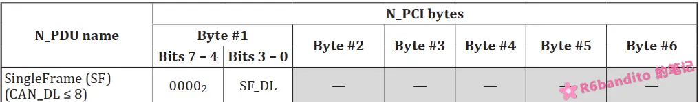
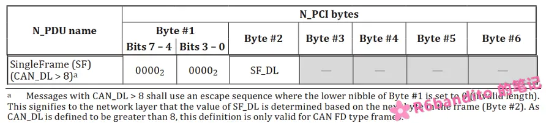
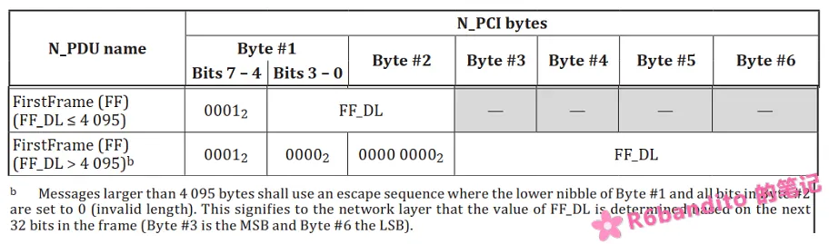
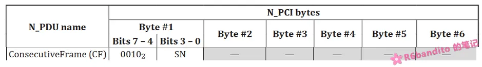
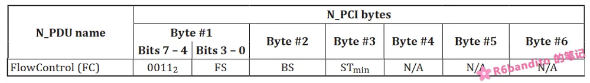
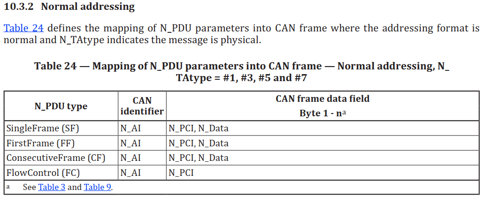
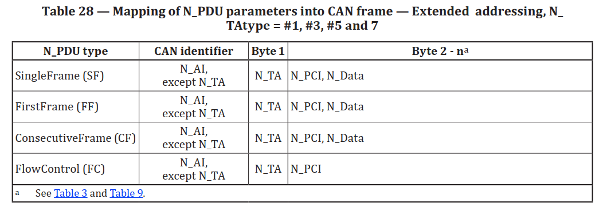

### 协议数据单元

在详细了解 ISO-TP 之前，首先需要了解 ISO-TP 的协议数据单元(PDU)，这是整个协议栈的核心。ISO-TP 定义了 4 个协议数据单元，分别是：单帧(Single Frame)，连续帧(Consecutive Frame)，首帧(First Frame)，流控帧(Flow Control)。

这四种 PDU 本质上都是一帧独立的 CAN 报文，区别在于报文的布局与含义。四种 PDU 协作共同完成单帧，多帧的传输动作。下面就来详细阐述下四种 PDU。

------

#### SF 单帧

iso-tp 支持单帧与多帧传输，SF 帧就是完成单帧传输的唯一 PDU 单元。在 Classic CAN 报文中，数据段最大8字节，其中SF 帧的数据段第一个字节为信息字节(N_PCI)，你可以将其理解为一个控制头，内部携带了与传输相关的一些控制信息。

对于 SF 帧，PCI 字节主要是这么划分的：

- **高 4 位**：这是 PDU 类型信息头，对于 SF 固定为 0b0000。
- **低 4 位**：这是 SF_DL。也就是该单帧承载的数据长度。表示本次单帧通信报文中，数据段有多少个字节的数据。

除开 PCI 信息字节，其余部分均为数据负载。这里要注意：根据通信模式的选择不同（普通寻址 / 拓展寻址），数据负载大小分别为 7 / 6 字节，这是因为在拓展寻址中地址数据被放到了数据场第一个字节，PCI 被顺延到了第二个字节。协议开销占了两个字节，因此为6字节负载。关于通信模式，后续会讲述，**只要记住拓展寻址地址会被放进数据段第一字节**这一点即可。

以下是 Classic CAN 在普通寻址模式下的 PCI 布局方式，截自 <ISO 15765-2:2016[E]>



当然，标准对 CAN FD 也提供了支持。CAN FD 单帧最大数据负载能够达到64字节，因此原先4位的 SF_DL 布局已然不够使用。CAN FD 的 PCI 布局方式如下图所示：

 

第一字节高四位依然是类型识别码，这是固定的，所有 PDU 都是这么规定。SF_DL 被放到了第二字节，总共能表示 255 大小的数据，足够了。拓展寻址下，地址会被放入Byte1位置，此时 PCI 信息字节 与 SF_DL 顺势各自后延一个字节，这里简单了解一下就好。

这里有个细节要注意下：原文中 "Messages with CAN_DL > 8 shall use an escape sequence where the lower nibble of Byte #1 is set to 0 (invalid length).  " **也就是说只有当Byte1低4位全为0时，Byte2才被认作是有效的 SF_DL**。这么规定是有原因的，因为 PCI 内部的识别码只能区分报文的类型，区分不了外部 CAN 控制器究竟是 Classic CAN 还是 CAN FD。标准实现内部在对 SF 进行处理时，首先会检查Byte1低4位是否为0，若不为0则按照 Classic CAN 处理；反之则按照 CAN FD 处理，继续读取后面第二字节作为 SF_DL。 如果你在尝试动手自行实现的话，这里尤其要注意。

------

#### FF 首帧

完成单帧通信，只需要一个 SF 帧即可。但是 iso-tp 重点不在于单帧报文通信，而是可靠的多帧传输与重组机制。而 FF 帧正是**用于启动一次多帧传输的开关**。FF 帧又叫首帧，其内包含了一个很重要的信息： FF_DL 本次多帧通信的数据长度。

启动一次多帧传输，首先必须要知道的一个元素就是本次通信的数据长度，对于发送方而言，这很好获取，要发多大的数据自身心里肯定有数；但对于接收方，这就是一个棘手的问题，接收方必须得知道数据有多长，以此来判断传输是否完毕，而数据总大小的来源只有从发送方获取，FF 帧正是被设计出来干这个事的。



PCI 布局上，固定高四位为类型识别码，FF 帧的类型识别码为 0b0001。对于数据大小 <= 4095 字节的多帧传输，FF_DL 占用了12位，而对于 > 4095 字节的多帧传输，协议支持将 FF_DL 映射到后续的连续4个字节，总共32位，理论数据量达到4Gb。

这里也要注意一个同样的问题：当传输数据大于4095时，原先12位 FF_DL 的位置必须被置0表示无效，具体原因参考上述协议栈对 SF帧 的处理。

这里我想讲一下，自行实现轻量化 iso-tp 时，对于常规开发，大于 4095 的情况可以选择性实现。因为对于常规MCU，我们通常是提供一整块缓冲去用于多帧接收，在一些性能中上的 MCU 中，拿出4kb左右的 RAM 做缓冲还是能够承受的，更何况大部分情况下可能用不到这么多。但是对于 > 4095 时，例如传输30kb数据，这在 iso-tp 看来是完全支持的，但是要在 MCU 中一次性开辟出30kb RAM 可是一笔不小的开销，在程序架构上就必须得使用流式传输。因此为了简化协议栈实现，我们可以只实现 < 4095 的情况，对于大于4kb的数据传输，采用分段切片传输即可。

FF 帧按标准是需要携带数据的！我们以普通寻址 Classic CAN 的标准8字节报文为例：构建一个 FF，PCI + FF_DL 共占2个字节，剩下6个字节要带上应用数据！这么设计的原因是保证总线利用率。当然，标准实现只是提供一个参考，你也可以直接发送一个2字节的短报文 FF 到对端，数据全部统一到 CF 中进行处理，这也是完全可以的。不过这些是属于各自实现的改造，我们本文只讨论标准实现。

至于 FF 帧如何启动一次多帧传输，此处暂时不展开。

------

#### CF 连续帧

FF 帧用于开启一次多帧传输，CF 帧则是多帧传输的主力军：携带数据包，作为通信的数据单元。不管是 CAN FD 还是 Classic CAN， 其 CF 帧的布局都是 一个 PCI 信息字节 + 数据负载。PCI 高4位位类型识别码：0b0010，低4位为 SN 序列码。SN 用于判断数据包到达的顺序，确保在多帧传输中及时发现丢包问题。

"that the SN shall start with zero for all segmented messages; the FirstFrame (FF) shall be assigned
the value zero; it does not include an explicit SequenceNumber in the N_PCI field but shall be treated
as the segment number zero;  "

"that the SN of the first CF immediately following the FF shall be set to one;  "

SN 序列码从0开始递增，在分段消息传输期间，每发送一个新的 CF，SN 递增 1，模16循环（数到15后回0，再从0开始到15循环）。首帧 FF 是隐含得有 SN = 0 这个概念的，**所以 FF 之后的首个 CF 其 SN 码应该是从1开始，而不是0**！之前我就没注意这个问题，虽然在发送端进行了正确处理，但是接收端却没有同步，发送方发来的第一个 CF 的 SN 为1，而我接收连接一直在等 SN = 0 的包，导致通信一直因为SN Dismatch出错。这里要注意。

注意：多帧传输过程，可能会涉及到 FC 帧的收发。FC 帧不参与 SN 的计数，SN 只表征 CF。



每一帧 CF （除开最后一帧）都必须填满数据段，中间不允许出现有空槽的包。最后一包数据可能已经塞不满一帧报文了，标准对于最后一帧 CF 报文允许出现短包。或者你也可以自行填充到8字节凑成一个完整包，填充到8字节对于逻辑实现比较简单，但是会浪费带宽，就看你怎么取舍了。这里我要强调一下，我是以 Classic CAN 为例子进行叙述的，如果你使用 CAN FD，那么得具体结合你一帧的负载总大小进行分析。

------

#### FC 流控帧

一次多帧传输事务中，流控机制是不得不考虑的因素。因为通信双方性能以及当前运行表现总是有差异的，若发送方不加控制的全速发送，接收方很可能由于处理跟不上导致出现丢包等异常情况；若发送方发送过慢，又会使通信效率打折，选择合适的流控参数是一次健壮高效通信事务的前提。FC 帧正是用于在开启一次多帧传输事务时，接收方向发送方传递流控参数。发送方必须严格遵守这个流控参数。

FC 帧的类型识别码为 0b0011。其 PCI 布局为高四位类型码 + 低四位 FS 码。FS 是流控状态，标准中定义了三个流控状态：

- **ContinueToSend (CTS)**：绿灯状态，由接收方->发送方，通知发送方可以继续 CF 帧的发送。
- **Wait (WAIT)**：黄灯状态，表示接收方当前正忙，请暂停一会发送(发送过程没有出现问题，只是接收方自身目前必须暂停接收来处理手上的急事)。 这里可以类比一下 TCP 的行为进行理解，在 TCP 通信中，当数据接收方通告窗口为0后，发送方会停止发送，直到对端窗口打开才会继续接下来的发送。iso-tp 也是类似行为，**发送方收到 WAIT 后，会立即停止发送，并启动超时定时器**。在该定时器超时之前收到 FC (除了OVFLW的任意状态)都能够重置定时器。当定时器超时后仍未收到 FC ，那么发送方将超时断开。当然，为了防止长时间被接收方阻塞，部分工程实现中还会增加一个计数器，每收到一个 WAIT 计数加1，若连续收到 WAIT 超过某个阈值，则也会主动断开连接。收到 CTS FC会解除 WAIT ，回到正常通信状态。
- **Overflow (OVFLW)**：红灯状态，接收方在收到一帧 FF 后，有权利拒绝本次通信的建立，这个权力便来源于此。FF 中携带有本次通信的数据总大小，当数据总大小 > 缓冲区大小时，可以发送 OVFLW 给对端终止通信，表示自身缓冲区将溢出，不能启动此次通信。当然规矩是死的，人是活的，对于流式传输架构，此处是否需要主动发送 OVFLW 就取绝于你的架构了。因为流式传输需要达到的目的本来就是小缓冲区复用来承接大数据，如果你的 FF_DL 含义是整个大数据块的总长的话，那么于此不应该也不能发送 OVFLW，因为 FF_DL > 缓冲区衡成立。



FC 流控帧除了流控状态码之外，还有两个核心参数：**BS(Block Size)**，**STmin(Separation Time min)**。

- **BS**：块大小，表示最大能够连续发送 CF 的数目。类似于 TCP 的滑动窗口，当窗口未被填满时，可以踩足马力发送，当窗口被填满时，必须停下来等待窗口重新开放。这里也是一样的，发送方发满 BS 后，会启动定时器并且等待下一个 FC.CTS 的到来，只有在正确收到 FC.CTS 后才会重新开始下一块 BS 的发送。
- **STmin**：两个 CF 之间的最小时间间隔。可以填0表示以最大速率，帧之间背靠背发送。

注意：FC 帧不允许携带任何数据。

这两个流控参数以及流控状态码，共同构成了 iso-tp 的流控机制。以上4个 PDU 单元便是整个 iso-tp 的通信核心，必须熟悉掌握。其中 SF 负责单帧通信；FF + FC + CF 共同构建起了多帧传输。

------

### 通信寻址模式

iso-tp 寻址模式分为了 **普通寻址模式** ， **拓展寻址模式**， **混合寻址模式**，以及一个广播用途的 **功能寻址模式**。

各种寻址模式，本质上区别在于 N_AI(协议地址信息) 的布局模式。不同寻址模式下，部分地址会被映射到 CAN 报文中不同的位置。这里先来讲讲 N_AI 地址信息。

CAN 是端到端的通信，对于普通 CAN 报文，只要是经过了过滤器粗筛的报文，都会被控制器照单全收存进 FIFO 。而 CANTP 由于涉及多帧数据包的传输与重组，因此每次通信必须精准匹配一个连接，仅靠底层过滤器的粒度是远远达不到要求的（虽然过滤器能够设置列表模式精准匹配ID，但成本昂贵且数量少，在多设备网络中不合算）。因此协议栈必须定义一个自身的地址信息规则，用于双端两个通信连接之间的正确匹配。

> The N_AI is used to identify the communicating peer entities of the network layer. The N_AI information received in the N_SDU (N_SA, N_TA, N_TAtype [and N_AE]) shall be copied and included in the N_PDU.   

N_AI 内部包含了几个关键字段，分别是：

 N_SA(Sender Address. 源地址/也即发送方地址)，N_TA(Target Address. 目标地址)，N_TAType(区分功能寻址)，以及N_AE(地址拓展)。N_AI 就相当于是一块电子身份证，每一帧都需要携带 N_AI 信息以便协议栈正确识别。接下来从普通寻址模式开始简单讲讲各个模式。

#### 普通寻址模式

普通寻址模式下，整个 N_AI 信息均被放置在了 CAN 报文的 ID 段。数据段完全留给 PCI 和实际应用数据，没有任何地址信息占用数据场，在 Classic CAN 场景下一个 SF 最多可带7字节负载数据。



在标准 ISO 15765-2:2016 中，并没有规定11位 ID 具体的 SA/TA 以及 TAType 的分配，只是强调了在 CAN 报文的11位 ID 段必须完整携带 N_AI 信息。具体的 N_AI 映射由上层应用或服务提供商自定义。

在我的应用中，通常将11位 ID 划分为：

| bit 6~10 | bit 1~5 |   bit0   |
| :------: | :-----: | :------: |
|   N_SA   |  N_TA   | N_TAType |

也就是：SA / TA 各5位，总共最多可表示 32 个节点，0位用于表示这是一帧物理帧还是功能帧(广播)。如果你的节点数量较少且固定，那么使用普通寻址模式是最常见，最高效的寻址方式。

------

#### 拓展寻址模式

拓展寻址模式与普通寻址模式，本质区别就是拓展寻址模式下，将 N_AI 拆散了。为了提升可用地址空间，标准将 N_AI 拆开，将其中的 N_TA 放到了数据段的第一个字节，数据段的 PCI 信息依次向后顺延一个字节。这也是为什么我前面说 SF 帧和 CF 帧的负载与寻址模式有关系，就是因为要考虑这个 N_TA 的存在与否。



拓展寻址模式下，我的布局是这样的：

| ID bit 3~10 |    ID bit2     | ID bit 0~1 | data bytes1 8bit |
| :---------: | :------------: | :--------: | :--------------: |
| N_SA(8bit)  | N_TAType(1bit) |  Reserved  |       N_TA       |

这样来看，SA 和 TA 各占8位，目标 256 个，源 256 个，网络节点容量直接比起普通寻址，提升了8倍。当然，在这种模式下，所以帧负载都要减1用于 N_TA 的单独开销。

------

#### 混合寻址模式

混合寻址模式综合了上述两者的特性：既在 ID 段中完整保留了 N_AI 信息，又在数据段中额外插入了 N_AE 作为地址拓展，共同组合而成的一个杂合模式。它的帧布局如下：

```
CAN ID [包含 N_SA + N_TA + N_TAtype]   ← 和普通寻址一样，完整的 N_AI 信息
Data  [ N_AE ][ N_PCI ][ N_Data ... ]  ← 数据场首字节塞的是 AE，而不是 TA
```

混合模式算是个比较偏门的模式，主要用于多网段之间的通信，在数据段多出来的这个 N_AE 就用于区分本地网络之外的子网。同时也达到了一个多网段中，地址全局且唯一的作用。

因为多个网段上，有很大概率会出现地址撞车的现象。例如A子网中有一台设备其地址为0x10，B子网也有一台设备地址为0x10。他们在本地网络中地址是没有重复的，但是一但涉及到跨网段通信，网关在转发时就会出现问题：两个都是0x10？那么究竟该转发给谁？

N_AE 正好解决了这个问题，N_AE 表示该帧报文要访问的是哪个子网中的 TA，不存在地址撞车问题(除非子网中仍有地址重复，不过这是典型的配置错误，与协议栈无关)。

这个模式一般使用较少，我也很少会用到该模式，此处只简单叙述下其工作模式与部分应用场景。

------

#### 功能寻址模式

这里要强调下，不同于上述三种寻址模式，前三种解决的是 “地址信息（N_AI）该放在帧的哪个位置”（布局问题），而功能寻址解决的是 “这帧报文哪些小组能收”。

在功能寻址模式下，N_TA 指向的不再是某一个具体节点，而是一组节点（或全部节点），该模式布局与普通寻址模式是一致的，区别在于 N_TAType 被定义为了功能寻址。

举个例子：我主控设备发一帧 0x7DF(TA) 的报文表示需要知道目前都有谁上线，所有配置了该功能 ID 的设备协议栈内部都会处理该广播报文，并以物理寻址单帧回复自己的地址。值得注意的是：**功能寻址只能用于 SF 单帧通信**。这是显而易见的，如果通过功能寻址模式启动多帧传输，那么总线上所有接收到该 FF 的节点都可能尝试回复 FC 流控帧，造成总线冲突和堵塞。在自行实现协议栈时，对于该种非法情况，一定要尽早在源头处拦截掉，同时在接收处理逻辑中丢掉可能误发的功能 FF 报文。

------

以上便是 ISO-TP 的通信基础元与相关的通信模式。值得注意的是：ISO-TP 是支持29位拓展 CAN 报文形式的，不过由于应用过少本文便只叙述了最常用的11位标准 ID 模式，如需更多了解可查阅 <ISO 15765-2:2016> 标准协议。
