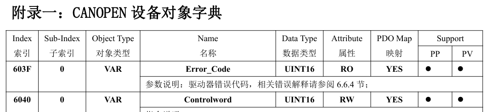

### 什么是CANopen

1986年，德国博世（Bosch）公司推出了 CAN 总线，全称 Controller Area Network（控制器局域网），成功解决了设备之间如何可靠的传输几个字节的问题。CAN 总线实时性高，可靠性好，一时间名声大振。但随着后续应用的深入，逐步暴露出了诸多问题：

CAN 总线只解决了物理层和数据链路层的问题，也就是说 CAN 总线只规定了怎么路由数据，而数据本身代表什么含义，怎么去理解统统没有定义。这就造成不同的设备厂商，各自持有一套自身的标准，相互之间移植性和通用性极差，有时候同一设备更换不同厂家的产品时甚至需要重写一套适配驱动。

为了解决这个混乱的问题，1992年 CiA(CAN in Automation)组织正式成立，负责专门把混乱的 CAN 应用层收编成一个统一的标准协议。1995年，CiA 发布了**CiA DS-301**（也就是现在的 CiA301 ），该协议定义了一套 CAN 应用层的标准规则，也就是我们后来所说的 CANopen。其核心设计理念就是：**统一用对象字典（OD）来表示设备的所有参数，用标准的 SDO/PDO 来存取这些参数。**

标准化的实现，使得不同厂商不需要再各自定义自身的私有协议，也简化了用户层面的压力：如果一台电机坏了，可以买任何支持 CANopen 的伺服替换，即插即用，而不必非得买原厂型号。

总而言之，**CANopen 的本质就是一套应用层的规范协议**。以经典网络四层模型来看，处于应用层。它不定义如何传输CAN 报文（这是 CAN 底层的事），而是表征了该帧报文的具体含义（参数读取/参数修改/节点状态切换）。

------

### 核心设计思想

CANopen 最精髓的地方在于每一个设备都维护了一套 OD 对象字典，该套字典本质上是一个巨大的内存地址表，内部存储了该设备的所有可配置参数。通过协议统一定义的通信模式以及通信数据元，使各个厂商的设备在同一条 CAN 总线或同一个 CAN 网络中高效的交换数据。这个被交换的数据就是 OD 字典内部的内存对象。

#### OD 字典

CANopen 通信的基础，整个设备所有的参数（温度/当前状态字/控制字等）全部放入了这张表中。每个参数都是独立的，并**通过16位的主索引 + 8位的子索引**来进行精准定位。

举个例子：某伺服电机的控制字在 0x6040 0x00 的位置，我们需要控制该电机，就可以通过 SDO 写入 0x40 0x60  0x00...来访问并修改这个状态字。这个例子中，0x6040便是16位的主索引，0x00便是8位的子索引。我们主控站不需要知道从站内部的具体结构，只需要知道我们要修改参数的地址即可。

以下是同毅IXL系列电机 OD 字典的控制字位置，可以看到也是 0x6040 0x00 的位置。这些伺服电机都是遵循 CiA 402 标准的，因此控制字都在这个位置。此处只是展示一下对象字典表，关于 CiA 402 标准本文不加以叙述。

------

#### SDO / PDO (服务/过程数据对象)

光有 OD 字典表是不够的，OD 字典只提供了数据的布局指导，还缺少读写接口来操纵这块内存表。CANopen 提供了两种类型通道，分别为 SDO (服务数据对象)，PDO(过程数据对象)。二者可以简单理解为慢速配置通道(SDO)与实时配置通道(PDO)。

**SDO**：一问一答机制，也就是说每个 SDO 请求，其接收方都必须回复响应报文。且 SDO 报文每次通信时必须带上16位的主索引与8位子索引。这也是为啥 SDO 报文不适用于实时控制通信，开销太大且额外的 ACK 机制影响实时性。一般用于上电初始化、修改波特率、PDO 映射参数等低频操作。

**PDO**：没有应答机制，并且得益于地址映射，PDO通信时报文中无需携带参数地址信息，因此 PDO 报文用于高实时性控制，且能够一定程度上容忍丢包（如每1ms发送一次报文，某个时间节点的报文丢了并没什么影响）。

这里简单介绍了 CANopen 通信的两个基础数据元 SDO/PDO 。关于这些数据元更加深入的认识将在其余文章进行阐述。

------

