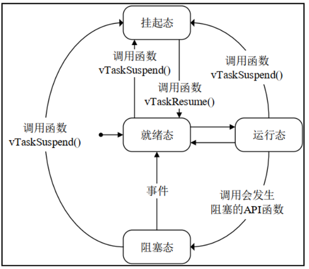
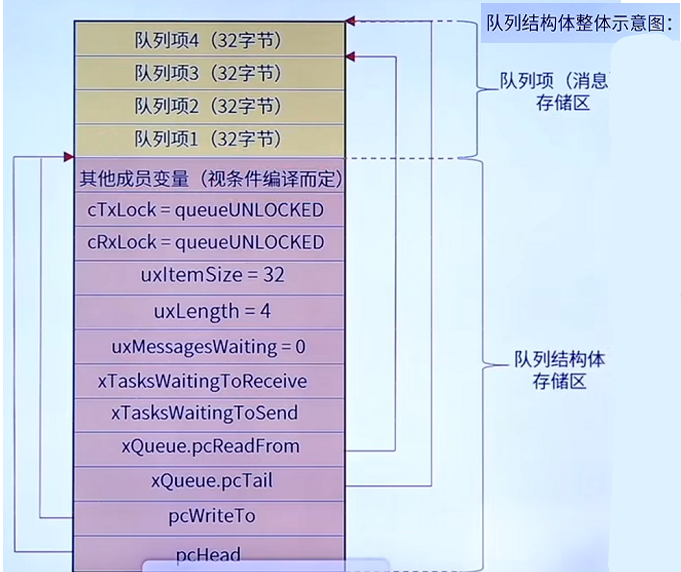
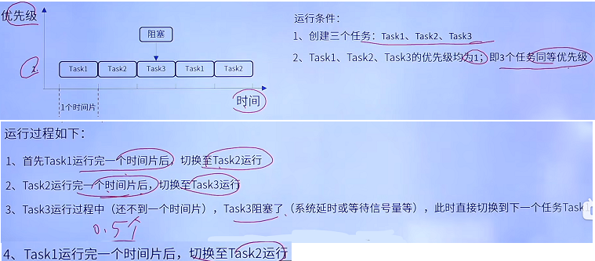
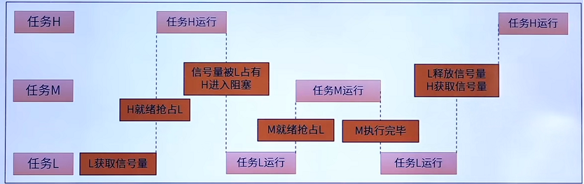

####  在 FreeRTOS 中创建一个任务后，任务可能处于哪些状态？请简要叙述每种状态的含义。

FreeRTOS中，常见的任务状态有 **就绪态**，**运行态**，**阻塞态**，**挂起态**。同时还有一个**删除态**，这个状态比较特殊。

创建完毕一个任务后，该任务就被挂入就绪列表，处于就绪态：等待调度器进行调度.

当一个处于就绪态的任务被调度器选中并执行时，该任务随即从 就绪态 -> 运行态.。表示该任务目前正被 CPU 执行。需要注意的是，在单核 CPU 中同一时刻只能有一个任务运行。

处于运行态的任务，若发生阻塞调用(例如 延时 / 等待事件或信号量 / 队列操作等)，则由 运行态 -> 阻塞态，并被挂入对应的阻塞事件列表；若用户手动调用 Suspend()，则任务进入挂起态，不再参与调度，直到显式被 Resume() 恢复。

处于运行态的任务在时间片耗尽，且同优先级有其余任务就绪的情况下，会发生时间片轮转（可配置），该任务会被放回就绪列表，调度器重新选择另一个处于就绪态的任务执行。

处于阻塞态的任务，若成功等到事件 / 超时，则会从阻塞态重新回到就绪态等待被调度。若解除阻塞的任务优先级最高，则立即发送任务切换。



这里简单聊聊 **删除态** ：

删除态是 FreeRTOS 的合法状态之一，当调用 vTaskDelete() 删除任务时，任务会进入该状态，同时该任务将被从可能有的 阻塞列表 / 挂起列表 / 就绪列表 中摘除，并挂入删除列表。然后由系统在空闲任务运行时，对其 TCB 控制块以及分配的栈空间进行释放(若未发生动态分配，则不会释放。由用户自行管理)。

------

#### FreeRTOS 中二值信号量与互斥信号量有什么主要区别？各适用于什么场景？

二值信号量与互斥量，在 FreeRTOS 中，二者的**本质都是队列**。与队列的区别在于，队列有数据段，而信号量/互斥量只使用到了队列的控制结构，自身没有数据段，算是一个特殊的队列。

从下图可以看到：普通的队列除了紫色的控制头区域之外，还有队列项，也就是数据区；而 信号量/互斥量 并没有队列项区域，所用到的只有紫色的控制头！



二值信号量常用于**任务间同步**与对于**低频事件的响应**。在存在三个及以上任务，且任务优先级呈梯度排列的场景下，不能够用于资源的保护，因为很大概率会**造成优先级的翻转**。

互斥信号量与二值信号量类似，但是互斥信号量引入了简易的**优先级继承机制**。同时会**记录持有的任务**，**遵循谁持有就由谁释放的原则**。互斥信号量极大程度上缓解了优先级翻转带来的影响，因此互斥量**主要用于多线程环境下，资源的访问保护，保证资源的串行化访问**。

> 要注意：ISR中不允许使用互斥量！因为 ISR 并没有任务上下文这一概念。

------

#### configUSE_TIME_SLICING 是什么？当多个任务具有相同优先级时，调度器如何工作？

`configUSE_TIME_SLICING` 是 FreeRTOS_Config.h 配置文件中的一个可配置项，**用于配置是否启用优先级轮转调度**的。

FreeRTOS 的常用配置就是 ： 不同优先级抢占式调度 + 相同优先级轮转式调度。因此该宏在大部分情况下都是默认启用的，除非你需要手动精准把控任务切换，否则保持默认打开即可。

当启用该宏后，对于同等优先级的多个就绪任务，每个任务轮流的享有 CPU 的时间片，在 FreeRTOS 中，一个时间片多长取决于系统 Tick 周期（Tick周期可通过  configTICK_RATE_HZ 配置）。



当执行完一个时间片后，SysTick 中断会触发内核进行调度检查，此时会去检查相同优先级下是否还有其余就绪任务。若有，则将当前任务挂到就绪任务列表末尾，等待下一次调度，同时取当前就绪列表头节点作为下一个待运行的任务。切换完毕后，新任务继续跑一个时间片，再次触发任务切换，以此循环反复。

要注意一点：抢占式调度与时间片轮转二者并不冲突，抢占调度的核心是以优先级为主，哪怕次优先级任务有多个已就绪，但是目前有1个最高优先级独占 CPU ，那么时间片轮转依然不会触发；只有等到最高优先级任务释放CPU，那么次优先级任务才会得到调度，并在这些就绪之间执行时间片轮转政策。

------

#### 什么是任务通知？与队列和信号量相比，有什么优势和局限性？

任务通知是内嵌在内核任务 TCB 中的一个属性，完全独立于队列和信号量。任务通知更加轻量化，不需要创建额外数据结构，其字段嵌在任务 TCB 中，在任务被创建并分配内存的那一刻就已可用。是一个**轻量化的通知系统**，并在通信过程中还允许携带一个32位变量，在通知目标对象的同时还能够传递一个值或标志。

典型场景比如中断的下半段处理：

例如我们期望在外部中断中置起一个标志位，然后在专门的任务中处理相关逻辑。例如下面一段示例代码所示

```c
// ISR 中（中断上下文）.
void EXTI0_IRQHandler(void) {
    // 清除中断标志位.
    HAL_GPIO_EXTI_IRQHandler(GPIO_PIN_0);
    // 直接通过任务通知唤醒任务（相当于Give）.
    vTaskNotifyGiveFromISR(xProcessTaskHandle, NULL);
    portYIELD_FROM_ISR(pdFALSE);
}

// 任务中（任务上下文）.
void vProcessTask(void *pvParameters) {
    while(1) {
        // 永久阻塞等待通知（相当于Take），拿到后自动清零.
        if (ulTaskNotifyTake(pdTRUE, portMAX_DELAY) == pdTRUE) {
            // 处理逻辑.
            process();
        }
    }
}
```

我们在中断中只置位标志，具体的耗时逻辑放到任务中进行处理。在这里我们使用任务通知直接唤醒对应任务，省去了创建二值信号量的开销，并且速度也更快。

任务通知可以携带一个32位变量，同时也可以间接携带大数据结构——指针在32位机中，是4字节32位的，这意味着你可以在任务通知中携带指针，这样可以间接携带大型数据结构。但是这不安全，如果一定要这么做请注意指针所指对象的生命周期！尤其不要传递指向局部数据结构的指针！

```c
// 发送方.
uint8_t g_sensor_buffer[32];
// 获取传感器数据...
// 将缓冲区的地址作为通知值发送出去.
xTaskNotify(xConsumerTaskHandle, (uint32_t)g_sensor_buffer, eSetValueWithOverwrite);

// 接收方.
void vConsumerTask(void *pvParameters) {
    uint32_t ulReceivedAddr;
    while(1) {
        xTaskNotifyWait(0, 0, &ulReceivedAddr, portMAX_DELAY);
        uint8_t *pData = (uint8_t*)ulReceivedAddr;
        // 直接处理该地址的数据.
        parse_sensor_data(pData);
    }
}
```

任务通知最大的局限性是：**只能实现任务间的点对点通信**。不像信号量或者队列，能交互多个任务。并且不像计数信号量或队列，任务通知只能保存一个待处理状态，当通知事件被高频触发时会导致丢事件（新事件覆盖旧事件）！因此对于接收网络包等事件要使用计数信号量或队列，不能够使用任务通知。

------

#### 关于优先级翻转的一些事，针对优先级翻转 FreeRTOS 怎么进行处理？

首先我们来看一个实例：有三个任务其优先级分别为： 任务A(H)，任务B(M)，任务C(L)，其中任务A和任务C需要访问一段共同的全局数据区域，因此二者之间需要进行访问保护。

先来看第一种情况，假如我们采用二值信号量来进行一个简单的防护，考虑以下流程：

任务A运行阻塞，任务B也处于阻塞状态，此时任务C独占 CPU 运行 --> 

任务C获取到信号量，继续执行逻辑 --> 

此时任务A阻塞结束，就绪。由于A为最高优先级，因此立即抢占任务C，任务C被挂回就绪列表等待下一次调度 --> 

任务A执行到获取信号量，由于信号量已经提前被C获取，因此任务A发生阻塞，此时再度唤醒任务C执行(前面整个流程种任务B始终阻塞) --> 

C重新得到运行，**请注意！此时任务B解除阻塞，由于B的优先级比C高，因此立即抢占C** --> 

我们假设任务B执行了一段长耗时逻辑，记作 t1，完毕后任务B重新进入阻塞 --> 

任务C重新得到执行，完毕后释放信号量。任务C执行的整个周期我们记作 t2。-->

任务A获取到信号量，解除阻塞，得到执行。

发现端倪没有？我们原意是：任务A应该等到C执行完后立即执行，也就是任务A被阻塞 t2 后得到响应（这是没办法的事，信号量本身就有阻塞语义，这段等待时间算是数据保护的代价，去不掉的）。但是实际呢？**我们高优先级任务A被阻塞了整整 t1 + t2 段时间**！**原本高优先级任务却被最后一个执行**！这还只是一个M任务的情况下，若有多个M任务交替就绪的情况下，我们的任务A会被阻塞多久？这严重影响了我们系统的实时性，是绝对不能容忍的。这就是优先级的翻转。



对于这个问题，FreeRTOS 引入了互斥信号量来解决。互斥信号量比起二值信号量，多了一个**优先级继承机制**：也就是获取该锁的任务，**其优先级会被临时提升到所有阻塞在该互斥量上的最高优先级任务的优先级**。在本例中，若使用互斥量进行保护，那么任务C会被临时提升到任务A的优先级，此时任务M就算就绪，由于优先级低于C，无法抢占。待任务C执行完毕后，释放锁，自身回到原优先级，任务A或得锁开始运行。在使用互斥量的情景下，我们的高优先级任务阻塞时间被确定到了 t2，优先级翻转问题得以缓解。

互斥量还有一个特性：互斥量内部会记录当前持有者任务的句柄，互斥量的释放只能由原持有者释放。而二值信号量是可以由任何任务进行释放的。也正是因为这个特性，所以**互斥量不允许在 ISR 中使用**。因为 ISR 不处于任务上下文，没有“任务”这一概念。

这里再说几点：首先优先级翻转是不能够被根除的，一旦使用信号量，且任务有优先级梯度，就闭然会出现高优先级任务被低优先级阻塞这一情况。只能让获取锁的低优先级任务尽快执行完，不被别的任务打断，进而执行我们高优先级的任务，这就是优先级翻转的常规缓解办法。其次，FreeRTOS 提供的只是一个简易继承机制，不存在链式继承。如果你的任务C同时也在等待另一个信号量，而该信号量被任务D(优先级更低)获取，那么当B就绪时，任务C就又会被优先级翻转！连带连累任务A。当然，这种属于设计问题，在进行布局时应尽可能规避这种使用场景。

------

#### xQueueSend 和 xQueueSendFromISR 有什么区别？在使用中断向队列发送数据时，需要注意什么？

首先我们需要明白在 FreeRTOS 中，对于队列以及信号量之类的一些操作给出了两套 API，这两套 API 最大的区别就在于是否被打上了 FromISR 的这个标签。例如：xQueuePeekFromISR()，  xQueueReceiveFromISR()，  vTaskNotifyGiveFromISR() 等等。

对于非 FromISR 后缀的API，如 xQueueSend ，是用在任务上下文的；而对于带FromISR的 API，如xQueueSendFromISR 是用在中断上下文的。**任务类型的 API 绝对不可以用在 ISR 中！FromISR API 虽然可以用在任务中，但是这不是规范做法，请不要混用**！下面来简单讲讲两类 API 的区别。

- 首先是**阻塞行为**，任务 API 提供阻塞超时机制，可以设置一个阻塞超时时间。当队列满(写操作)或队列空(读操作)时，调用该 API 的任务会进入阻塞态，等待队列腾出空间，直到超时或成功写入；而中断 API 移除了阻塞行为，绝对不能够发生阻塞（RTOS中阻塞会触发任务调度，ISR中进行不了任务调度！）。当操作条件不满足时，将立即返回。

- 唤醒行为差异(**延迟切换**)：
  在 ISR 中，我们操作队列时多半是以下面的形式进行：

  ```c
  void UART_IRQHandler(void) {
      uint8_t data;
      // 从硬件寄存器读取数据...
      BaseType_t xHigherPriorityTaskWoken = pdFALSE;
      xQueueSendFromISR(xQueue, &data, &xHigherPriorityTaskWoken);
  
      // 其他中断处理...
      portYIELD_FROM_ISR(xHigherPriorityTaskWoken);
  }
  ```

  发现了吗？我们需要透传 xHigherPriorityTaskWoken 这个变量进入FromISR API，而后将其传入portYIELD_FROM_ISR()。缘何如此？这就要提到 RTOS 内核的切换机制了，这里简单讲讲：队列/信号量等操作是可能随时唤醒一个高优先级任务的，因此在这些操作结束后我们需要触发一次任务切换来检查下当前是否因为刚刚的操作导致有高优先级任务就绪。
  对于任务型API，内部在队列/信号量操作后，**会立即检查是否需要执行切换，若需要则立即切换**；而 ISR 中不能进行任务切换！因此在操作完成后，需要将切换标志放进 xHigherPriorityTaskWoken 这个变量中进行存储。后续在 ISR 即将退出时，显示调用 portYIELD_FROM_ISR() 来标记一次切换请求（本质就是请求一次PendSV），而后当所有 ISR 全部执行完成后，在中断后半段再进行任务切换（也就是我们说的延迟切换）。

 这里只是以 Queue 队列操作举个例子，实际上所有带 FromISR 后缀的 API 与原型 API 的主要差异都是上述两点。xQueueSend 用于任务，支持阻塞和自动调度；xQueueSendFromISR 用于中断，不支持阻塞，要手动触发切换请求。不要用混了！
