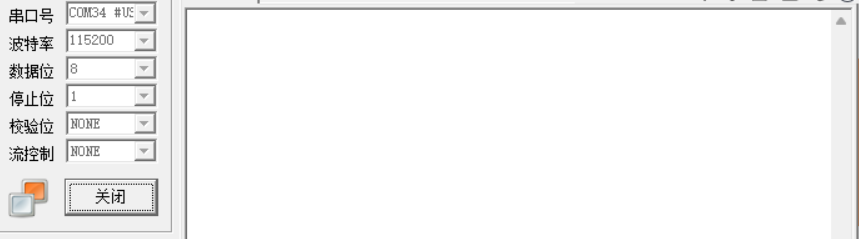
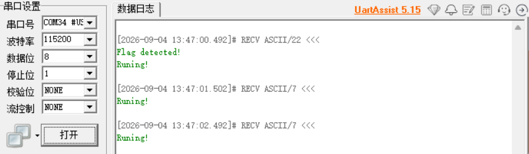

#### C语言中的 static 关键字

static 关键字用于声明一个静态数据，修饰变量或函数时作用各不同，这里简单讲讲：

- **修饰全局数据结构**：这个很简单，就是**将被修饰的全局数据结构作用域严格限制在本模块内**。例如在 uart.c 中有一个全局数据变量： `static UART_HandleTypeDef huart;`  在另一个模块 app.c 中就不能够使用 extern 来获取这个变量。对于函数也是一样的，其一旦被 static 修饰，表示这是一个内部独有功能模块，就不能通过.h向外引出给别的模块使用。在日常使用中，秉承接口简洁易用的原则，对于一些只在库内使用的辅助功能 API 就可以打上 static ，没必要暴露给外部。

- **修饰局部数据结构**：修饰局部结构是 static 的一个重点特性，它不限定作用域，而是**起到一个数据结构生命周期常驻的作用**（我们都知道局部数据结构生命周期只在本次调用，一旦返回返回出栈就被销毁了）。如下示例：

  ```c
  void 
  funciton_A( void )
  {
      int8_t temp_var = 0;
  
      printf( "temp=%d", temp_var++ );
  }
  ```

  `temp_var` 作为局部数据结构，在当该函数被调用时创建，当函数退出时出栈被销毁。因此该变量并不具备重入“记忆”功能。我们在外部循环调用`function_A`得到如下结果：
  temp=0

  temp=0

  temp=0

  temp=0

  ....

  当我们使用 static 修饰 `temp_var` 时，该变量的内存位置不再是局部，而是位于全局静态数据区，**生命周期被提升到了全局**。此时我们继续循环调用，就能看到如下结果：

  temp=0

  temp=1

  temp=2

  temp=3

  ...

  最后总结一下：对于 static 修饰局部数据的情况，局部数据的作用域是不会发生改变的，改变的是局部数据的生命周期。其存储位置从一开始的局部任务栈变为了全局数据区(.data/.bss)。

  这里要强调下：不是说程序运行到 static 处才把变量放到全局数据区，而是在编译阶段该块内存就已经被开辟到全局数据区了，该变量在函数调用时永远不会被压栈创建或出栈。

------

####  C语言中的 sizeof 关键字

sizeof **用于计算一个类型或变量在内存中占用的字节数，其返回值类型为 size_t**。这里要注意，sizeof 不是函数调用！sizeof 在运行阶段是看不到的，不存在函数调用的压栈出栈过程。sizeof 计算式是在编译期被展开和计算的。

```c
void 
funciton_A( void )
{
    uint8_t ver = 0;
    sizeof( ver++ );
    printf( "ver=%d", ver );
}
```

上面示例运行后，得到 ver=0，也进一步说明了sizeof 并不属于函数调用，在运行阶段看不见，ver++也没有被执行。

sizeof 只关心类型，你比如：

```c
int arr[10] = {0};
int *ptr = arr;

void 
funciton_A( void )
{
    printf("%zu\n", sizeof(arr)); // 40 (整个数组大小：10 * 4)
    printf("%zu\n", sizeof(ptr)); // 4 或 8 (指针本身的大小，取决于平台位数. 32位MCU为4字节)
}
```

sizeof 的使用频率是比较高的，这里简单讲几个容易出错的例子：

- 在计算结构体类型的数据占用空间大小的，要考虑编译器的对齐模式！除了对齐到1字节是不需要填补(padding)字节之外，其余对齐模式大部分情况下均需要考虑结构体对齐！结构体对齐此处举个示例，不做更多解释：

  ```c
  struct myModule
  {
      char a;
      int b;
      short c;
  
  } module1;
  
  void 
  funciton_A( void )
  {
      printf( "structure: %d\n", sizeof(module1) ); // 12. 不是 7!(编译器4字节对齐)
  }
  ```

- sizeof 可用于取数组大小，但是当数组通过指针作为函数入参进行透传时，将退化成指针形式，不能直接使用sizeof 取大小。

  ```c
  int arr[10] = {0};
  
  void 
  funciton_A( void )
  {
      function_B( arr );
  }
  
  void 
  function_B( uint8_t *pArr )
  {
      printf( "ArraySize: %d\n", sizeof(pArr) );  // 4.
      printf( "ArraySize: %d\n", sizeof(arr) );   // 40.
  }
  ```

- C 语言与 C++ 对字符常量定义的类型不同，用 sizeof 取出的大小也不相同。对于 sizeof('a')，C语言中将其类型解释为 int ，因此算出来为大小4；而 C++ 中将其类型解释为 char 类型，因此算出来大小是 1。这里要注意。

------

#### C语言中的 volatile 关键字

volatile 用于告诉编译器**对被修饰的变量不要执行指令重排以及缓存优化**，保证每次对该变量的访存操作都必须从实际的物理地址读出。之所以需要该关键词，是因为编译时有多档优化策略，对于一些随时可能由底层硬件改变的变量，若优化过于激进则可能会将该变量值进行缓存，无法及时响应变化导致程序出现问题。

嵌入式中，以下几个场景最好使用 volatile 保证程序的可预测与安全性，尤其是第一种情况，必须使用 volatile 关键字！

- **外设寄存器地址映射**：这种情况必须要加！硬件寄存器的值随时会被底层更改，如果不加 volatile，编译器可能只读一次寄存器值放进通用寄存器 R0，然后就一直用 R0 里的旧值，永远读不到最新结果。

  ```c
  #define     __IO    volatile             /*!< Defines 'read / write' permissions */
  
  typedef struct
  {
    __IO uint32_t SR;         /*!< USART Status register,                   Address offset: 0x00 */
    __IO uint32_t DR;         /*!< USART Data register,                     Address offset: 0x04 */
    __IO uint32_t BRR;        /*!< USART Baud rate register,                Address offset: 0x08 */
    __IO uint32_t CR1;        /*!< USART Control register 1,                Address offset: 0x0C */
    __IO uint32_t CR2;        /*!< USART Control register 2,                Address offset: 0x10 */
    __IO uint32_t CR3;        /*!< USART Control register 3,                Address offset: 0x14 */
    __IO uint32_t GTPR;       /*!< USART Guard time and prescaler register, Address offset: 0x18 */
  } USART_TypeDef;
  ```

  这是ST官方 HAL 抽象层关于 USART 的一个类型定义，可以看到内部对于每个外设寄存器均采用 volatile 保护。

- **任务上下文与 ISR 共享的全局变量**：
  编译器在编译主循环代码逻辑时，是不会考虑 ISR 的。这就会导致一个问题：当优化行为十分激进时，例如有while(flag == 0)，其中 flag 只在中断中被修改。当主循环进行编译时，会发现主逻辑代码里面没有修改 flag ，因此为了加速访存，可能会理所当然的将该变量的值读到内部通用寄存器中，后面的循环再也不去内存读真实值了。程序逻辑自然也偏离了我们预期的行为。
  来看下面这个例子：

  ```c
  int key_pressed = 0; // 没加 volatile!
  
  void EXTI0_IRQHandler(void) 
  {
      key_pressed = 1; // 中断来了，修改了这个值
  }
  
  int main(void) 
  {
      while(1) 
      {
          // 等待按键按下
          if (key_pressed == 1) 
          {
              printf("Key pressed!\n");
              key_pressed = 0; 
          }
      }
  }
  ```

  程序在逻辑上似乎没什么问题，但是当编译器优化比较激进时(-O2，或更高)，编译器可能会尝试将 key_pressed 这个变量值移入内部寄存器中，以便加速读取。但是一旦被放入寄存器缓存，那么当中断触发时，就算key_pressed已经被中断修改了，但是主循环依然拿到的是寄存器中的缓存旧副本。后续程序运行均在读取旧值，if 语句可能永远进不去。
  而若 key_pressed 使用 volatile 修饰，则编译器不会缓存，每次访存都会强制从具体地址读取。因此中断修改值后，主循环能够正确读取到更新值并触发对应逻辑。

- **RTOS 环境下多任务间的共享变量**
  道理与上述 ISR 与主循环的逻辑是一样的。编译器在编译代码时并不知道所谓的什么任务调度器，也不会考虑到当前编译的代码可能会被别的任务打断这种情况，因此在优化比较激进的情况下，也会产生一些非预期的指令重排和变量缓存的情况，进而导致程序跑飞。考虑下面程序：

  ```c
  void Task_Read(void) {
      while(1) {
          // 编译器看到：这里只有读操作，没有写操作
          if (g_data_ready == 1) { 
   
   			// .....
          }
          vTaskDelay(1); // 让出 CPU
      }
  }
  ```

  示例中，高优化程度的编译器在编译这段代码时，会看到整个 Read 函数 if 之前只读了 g_data_ready ，并没有修改。为了效率会将 g_data_ready 缓存起来，下次判断直接用它来判断，节省了总线的带宽。但是这显然不对，因此需要 volatile 保护。

由于 volatile 的实验要求有些高，不是很容易看见现象，此处我给出一个具体可用的，能直接观察的 volatile 示例：

```c
// main.c
uint8_t flag = 0;  // 这里没有加 volatile.

void 
task1( void *parametre )
{
  
  while ( flag == 0 )
  {
    // do nothing.
  }

  printf("Flag detected!\n");
  flag = 0; 

  while(1)
  {
    printf("Runing!");

    vTaskDelay(1000);
  }
}

// it.c 
extern uint8_t flag;
void 
HAL_TIM_PeriodElapsedCallback( TIM_HandleTypeDef *htim )
{
  static uint16_t count = 0;
  if ( htim->Instance == TIM6 )
  {
    HAL_IncTick();
    if ( (count++) == 500 )
    {
      count = 0;
      flag = 1;
    }
  }
}
```

上述示例中，我们在 task1 内部读取 flag 标志，而该标志的修改在 TIM 的 ISR 上下文。此时对于编译器而言，在高优化程度下，首先会**检查该变量是否被 volatile 修饰**，因为 volatile 是硬约束，编译器无权删/并/挪；之后编译器会**检查自身可见的代码路径上是否有任何可能改写该变量的操作**：例如函数调用或显示赋值。在 `while ( flag == 0 )` 这个窗口下，没有任何函数调用和直接改写操作。而编译器又看不到中断、DMA、别的任务之类的，因此不会将他们视作威胁。

就这样，编译器直接放心大胆的将 flag 进行缓存，所以上述程序运行现象应该是不会打印任何信息。实测也确实是这样（-O3优化等级），可以看到调试器中没有任何输出。



接下来我们将 flag 使用 volatile 修饰：

```c
volatile uint8_t flag = 0; 
```

再次运行，可以看到调试器已经有输出，程序逻辑正常运行



说明 volatile 成功阻止了编译器的优化，强制每次访存必须重读具体地址。

既然 volatile 更安全，那么全局数据都用 volatile 保护不就好了？这个肯定是不可以的，volatile 等于是放弃了编译器的优化，因此程序执行效率会受到影响。

------

#### i++ 与 ++i

两个都是C语言中的自增运算符，区别就是一个是前置自增(++i)，一个是后置自增(i++)。

后置自增就是先返回当前值，再将变量i自增。这里要注意的一点是：**后置自增返回的是保存了旧值的一个临时副本**，而后i再自增；前置自增是变量i先自增，再返回。期间不会产生临时数据结构。

因此，i++不能作为左值（因为返回的是临时数据结构），而++i可以作为左值（返回的就是变量本身）。

```c
int i;
i++ = 10;   /* 错误! 后置自增不能做左值. */
++i = 10;	/* 前置自增由于返回的是变量本身，因此可以作为左值. */
```

这里讲一个容易入坑的地方，先考虑下面这一段程序：

```c
int *p;
int buf[2];

void 
function_A( void )
{
   p = buf;
   *p++ = 10;
   *p = 20;
}
```

这里一定要分清，*p++ 等价于 *(p++)，即先取 p 的旧地址解引用，而后 p 自增指向下一个位置。因此buf[0] = 10,buf[1] = 20。由于p++返回的是地址，而我们是对地址做解引用运算，因此不存在左值问题，哪怕它是后置自增运算。

单独使用的情况下（++i/i++独立使用），二者的行为都是做一次自增，效果完全等价。

------

#### 指针数组与数组指针

二者本质就是一个是数组，一个是指针，这里简单解释一下。

**指针数组** `int *p[10];`：C语言中，[]运算符的优先级是大于 * 的，所以p先和[10]结合表示p是一个深度为10的数组，剩下的 int * 表示数组中每个元素的类型是指向 int 的指针。

因此 `int *p[10];` 表示一个存放了10个 int * 的数组，也叫做指针数组，数组内部的元素是指针类型！

**数组指针** `int (*p)[10];`：由于括号存在，*优先与p结合，表明p是一个指针，而后与[10]结合表示指向一个 int [10]的指针。

因此 `int (*p)[10];` 表示这是一个指向存放10个 int 类型的数组的指针。

```c
int *p1[10];   // 指针数组.
int (*p2)[10]; // 数组指针.

printf("%zu\n", sizeof(p1)); // 在 32 位机下输出 40 (10 个 int * 指针，每个 4 字节).
printf("%zu\n", sizeof(p2)); // 在 32 位机下输出 4  (仅有一个指针).
printf("%zu\n", sizeof(*p2));// 输出 40 (因为 p2 指向的是 10 个 int 的数组，10*4=40).
```

以下是指针数组的应用场景之一：

做 AT 命令的串口解析时，通过指针数组构建一个命令表，进行查表匹配

```c
const char *cmd_list[3] = {"AT", "RESET", "READ"};
// cmd_list 是一个数组，里面存了 3 个指向字符串常量的指针。
// 你可以通过 cmd_list[0] 拿到 "AT" 的首地址。
```

对于数组指针：

假设你有个 3 * 128 的 LCD 缓冲区，可以通过数组指针来逐个操纵每行的数据。如下所示：

```c
uint8_t screen_buf[3][128]; // 假设 3 行 128 列

void 
process_row( uint8_t (*row)[128] ) 	// 入参是一个数组指针.
{ 									
    // 此时 row 指向 screen_buf[0] 这整一行.
    for (int i=0; i<128; i++) 
    {
        (*row)[i] = i; // 操作该行数据.
    }
}

// 调用时：
process_row(screen_buf); // 数组名退化为指向第一行的指针（即数组指针）.
```

------

