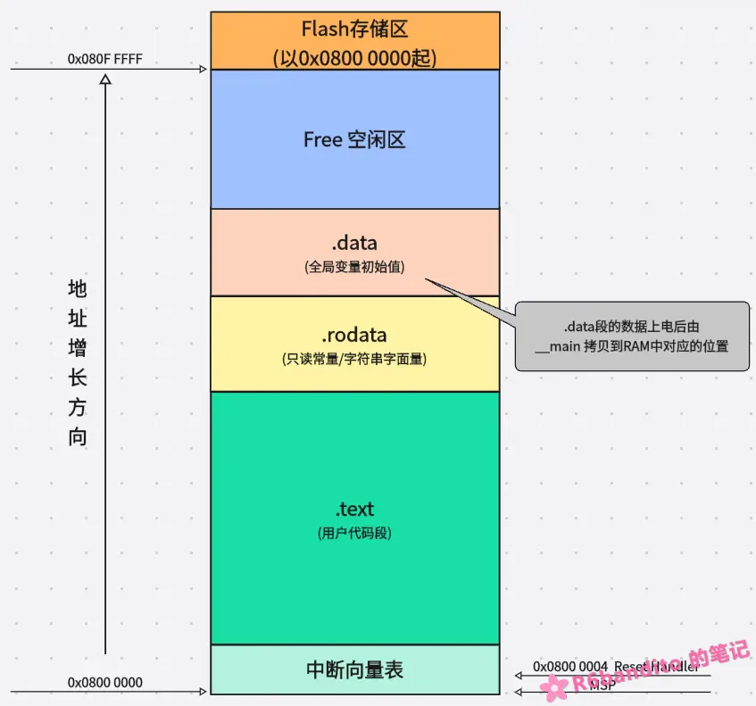
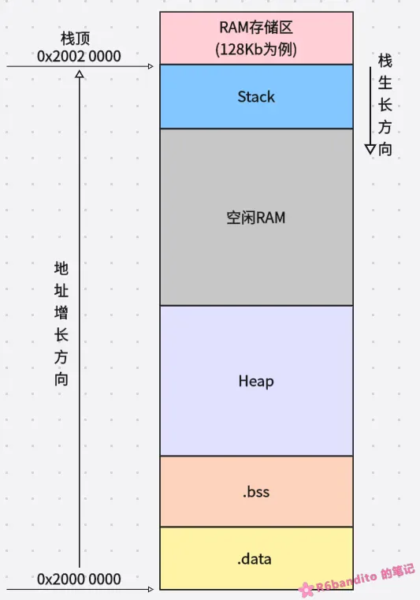

#### Flash布局

Cortex-M 架构中，Flash 主要可以细分为图上几类。文本段(.text)中包含可执行代码 (Executable Code)和常量 ，在文本段之后就是只读数据区域 (.rodata)，只读数据后紧跟着的就是全局数据(.data)。

被显式初始化的全局数据结构的初始化值就存放于 .data 处，每次上电 __main 都会从该区域将初始化值拷贝到 RAM 中对应的位置，进而全局数据结构可以在一进入用户程序流程就已经被显式赋值。

这里要强调一点就是：**并不是所有MCU都是这么布局的，这里只针对 Cortex-M 架构**。

- 为什么中断向量表始终放在最低地址？

这是因为MCU复位后，固定会去 0x0000 0000 寻址 MSP 和 Reset Handler 进行启动流程，因此它第一眼必须看到向量表。在这里，0x0000 0000并不是真实的物理地址，而是经过 CPU 映射后的地址。

**硬件复位时，CPU 自动将 Flash的首地址映射到 0x0000_0000。而后强制从 0x0000_0000 取四字节作为 MSP，再取四字节作为 Reset Handler**。

- .data 段的双重身份

在 Flash 中，.data 叫作 LMA (加载地址)。

在 RAM 中，.data 叫作 VMA（运行地址）。

很直白，每次都从 Flash 中加载到 RAM中，记住这一点就好。

------

#### RAM 布局

RAM中 .data 段是**存放有初始化值的全局数据结构的具体内存位置**，在 Flash 中 .data 段**存放具体的初始化数值**。上电后由启动脚本进行搬运，上述 Flash 处已经叙述得足够详细，此处不再赘述。

.bss 紧随 .data 之后，也是一段连续的内存空间，其主要存放未显式初始化初始化为0的全局数据或静态数据结构。上电流程中，__main 会将该区域清0。

Heap 是堆区，可由启动文件修改其大小。本质就是一块静态巨型数组，采用C标准的动态内存管理算法(malloc/calloc/free等)进行管理。由于**会产生内存碎片，且分配时间不确定，不可重入**等特性，因此该区域实际上会被修改得很小，基本用不上。

这里要重点关注的是栈(Stack)：

Cortex-M 的栈是**满递减栈**（**Full Descending**），也就是栈指针初始时在最高地址，每压入一个数据，SP  就减小，向低地址走。把栈放在最高地址，能让它向下生长时拥有最大的可用空间，避免一开始就撞到 .bss。

这种“两头往中间挤”的设计，最大限度地利用了 RAM 空间，但也带来了溢出碰撞的风险。

**关于栈溢出**：

由于栈的生长方向向下，因此我们假设栈一直往下生长（例如开辟了一个局部超级大数据结构），在实际布局中，空闲区剩不了多少，Heap也很小。此时 SP 会跨过空闲区直接击穿 Heap ，现象自然就是堆区数据结构被破坏，malloc/free 失败。而后侵入 .bss 所在位置，将全局数据进行篡改。 

这也是为什么不允许在栈局部开辟大型结构的根本原因。

------

