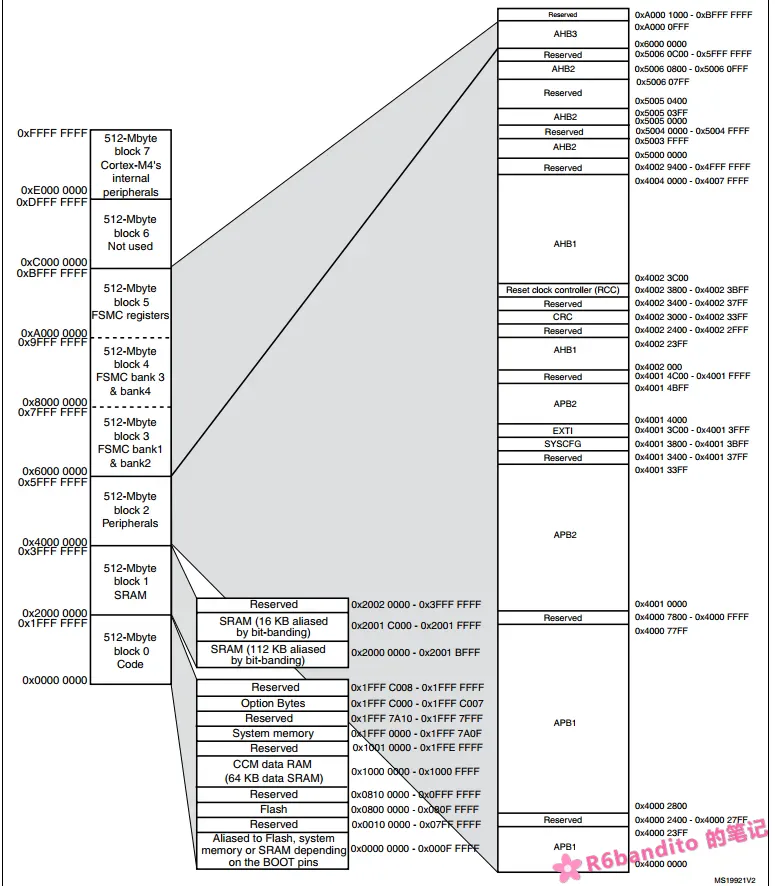
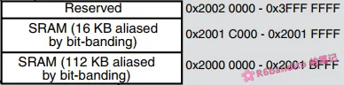
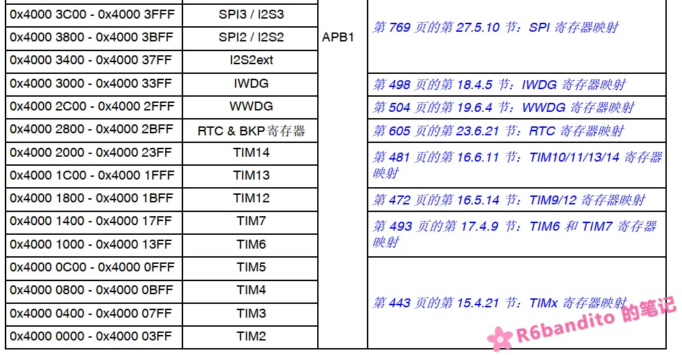

#### Cortex-M4 地址空间布局

ARM-Cortex M系列的MCU是32位的，因此理论寻址空间也是32位的，达到了4GB（0x0000 0000 ~ 0xFFFF FFFF）。ARM 把这 4GB 按照功能划分成了 5 个固定的分区，不管是哪一家的设备，只要是 Cortex-M 架构，就必须遵从这个设计。然后各自芯片厂商再在此架构下，填充自身的具体设备。

这里以 Cortex-M4 为例，以下是 Cortex-M4 的 DataSheet 地址空间布局概览图：

 

#### 代码区(Code)

先来看 0x0000 0000 ~ 0x1FFFF FFFF 部分

这里主要是代码区(Code)，也是 Flash 与 ROM的映射区，CPU 通过 I-Code/D-Code 总线取指与读常量。

这里首先要注意一下，CPU复位后，强制从0x0000 0000这个位置取向量，但是 0x0000 0000 这个地址只是一个映射地址，并不是一个有效的物理地址。至于 0x0000 0000映射到哪里，取决于你的BOOT0与BOOT1引脚的配置。

- **BOOT0 = 0**：映射到 **Flash（`0x0800 0000`）**（正常启动流程）。
- **BOOT0 = 1, BOOT1 = 0**：映射到 **System Memory（`0x1FFF_0000`）**（出厂固化的一个 Bootloader，也就是我们有时候会用到的串口烧录）。
- **BOOT0 = 1, BOOT1 = 1**：映射到**SRAM（`0x2000_0000`）**（从 SRAM 启动）。

正是有了这种映射行为，我们才可以通过调整 BOOT 引脚来进入不同的程序模式。

由于我们使用的是 Cortex-M4 系列，因此有一个 CCM SRAM也被放到了 Code 区的内部。不过该段 RAM 只连接到了 D-Code 总线，因此可以供CPU快速取数据，但是不能将你的代码放入进去让CPU去取指执行，因为没有连接到 I-Code 总线。

选项字节(Option Bytes)也被放置到了该区域的 (0x1FFF C000)区域，这里了解就好。

其余部分 Reserved 保留。

------

#### SRAM区

SRAM区映射在 0x2000 0000 ~ 0x2002 0000（ 128Kb ）。这里是我们的片上 SRAM ，如果你用调试器监控过全局数据的话，会注意到其地址都是 0x200x xxxx 开头的，正是因为我们SRAM被映射到了这一块地址。我们的 .data、.bss、Heap、Stack 都被划分到了这一块空间中。

这里可以看到，我们的128 Kb SRAM 的来源并不是一整块大的空间，而是物理上焊了两块独立的 SRAM，并且把他们挂到了 AHB 总线的不同端口上。虽然逻辑上看起来是连续的，但是实际上是两块独立的物理设备。

这么做是为了提高访问效率，如果合并为一块用一个端口，那么当 DMA 和 CPU 均需要访问这块空间时，必须得有一个停下来等另一个操作完毕。而如果划分为独立的两块挂在不同的端口上，则二者可以走不同的通道，实现真正的并行访问。

在优化时，**可以将需要 DMA 搬运的大容量数据放在SRAM 112Kb中，将需要CPU访问读取的数据放在 SRAM 16 Kb中，可以避免 CPU 访问和 DMA 搬数据时互相堵塞，有效提升运行效率**。

其余部分 Reserved 保留。

------

#### 外设区(Peripherals)

外设区就是用来映射外设寄存器地址的。我们常用的 GPIO、UART、CAN、SPI、DMA 等外设及其寄存器地址都映射在这块区域内。

从上面总概览图已经可以看出，APB1 APB2 AHB 这些总线依次映射在该块区域。

同一条总线上的外设，地址是按顺序连续分配的。比如 APB1 的 TIM2 基址是 0x4000_0000（起始），TIM3 是 0x4000_0400，TIM4 是 0x4000_0800……每个外设占 0x400（1KB）空间，里面存放该外设的所有寄存器。

这里只是展示地址布局，不展开讨论。

------

#### 外部存储区(FSMC)

外部存储区是 Cortex-M 地址空间中的一块特定区域（0x6000_0000 ~ 0x9FFF_FFFF），由 FSMC 管理。它负责将外部的 SRAM、NOR Flash、NAND Flash 或 LCD 等并行设备，映射到 CPU 的地址空间，使 CPU 可以像访问内部 SRAM 一样，通过简单的指针读写来访问外部设备。

我们以 FSMC 驱动 8080 并口的LCD作为例子：
当你向 0x6000_0000 + 偏移量 写入一个 16 位数据时，FSMC 硬件会自动完成一些时序动作，比如：片选信号或数据电平，或者锁存寄存器等操作。这里我们不展开讨论，只需要知道这块区域的用途即可。

------

#### 内核外设区(Internal Peripherals)

虽然此处字面翻译为这个，但是还是建议理解为**系统私有寄存器映射区**。这里是系统的控制空间，你比如我们常用的 NVIC，Systick，VTOR 以及一些调试组件等等，这些的配置全部映射在了这个区域中。

这里需要注意的是：这段空间是由 ARM 划定的固定地盘，也就是不管是哪一家的芯片(GD32/NXP等等)，只要是 ARM Cortex-M 的架构，这块区域都是一样的。在进行一些跨平台的芯片移植时，只要双方都是 Cortex-M，那么与这个地址部分相关的一些底层外设的程序是无需修改的。

------

