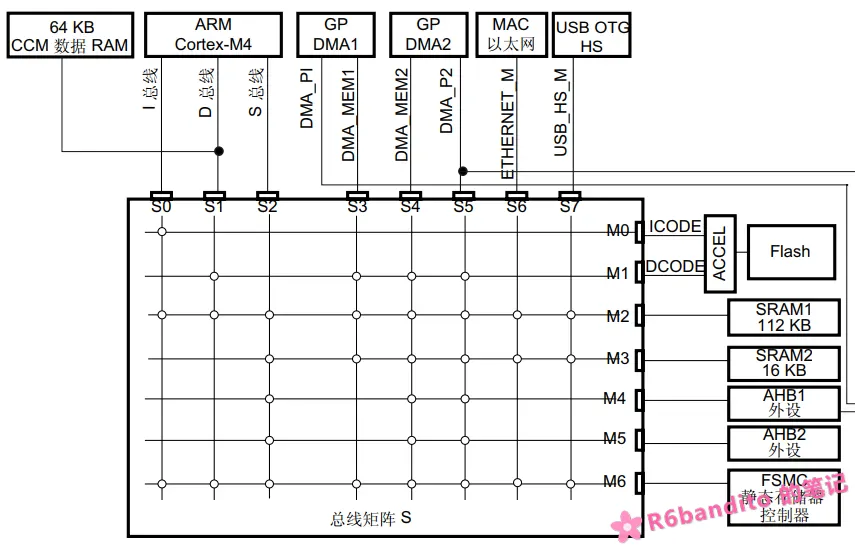

#### 什么是 CCMRAM？

以 STM32F407 为例，平时我们在使用的时候总会听到 128Kb SRAM 以及 192Kb SRAM 的相关型号，

这里，不管是192还是128，其实代表的都是同一个型号。从192Kb的视角来看，其表征的是**芯片内部物理上真实存在的全部 SRAM 总容量**，其中可拆分为 (128Kb + 64Kb)。

- **主SRAM(128Kb)**

这128Kb的主SRAM是常规内存，可以被DMA以及我们CPU进行访问。其中，128可进一步拆分为(112Kb SRAM1 + 16Kb SRAM2)。此处对于 SRAM1/SRAM2 不详细展开。

- **CCM SRAM(内核耦合内存)**

内核耦合内存是一块特殊的SRAM，其地址空间被映射在 Code 区的 0x1000 0000（关于 ARM Cortex-M的地址空间布局，详见：）。这块内存最大的特点就是并**没有被挂在AHB总线矩阵上**，而是**直接连接 Cortex 内核的 D-Code 总线**。



上图是总线矩阵架构图，从图中可以看出：SRAM1/SRAM2 作为通用内存，DMA与CPU均能够访问，而CCM RAM直连 D-Code ，这也就意味着 **只有CPU能够访问这块内存，DMA够不到这个地方**！这是CCM RAM与 普通 RAM 的最大区别所在。

CCM 挂在 CPU 私有总线上，**AHB 总线矩阵里根本没有它的地址**。DMA 控制器作为 AHB 主设备，**物理上完全看不到 0x1000 0000 这片区域**。如果你把 DMA 的目标缓冲区（比如 ADC 采样数组）定义在 CCM 里，DMA 搬运时总线会直接返回一个错误响应，触发 HardFault。

总的来说：这一块内存最适合放那种 **CPU频繁读写，但是却不需要 DMA 参与的数据**。

------

#### CCMRAM 的使用

在默认内存布局的情况下，CCMRAM是不启用的。也就是说你定义的所有的数据结构均存放到了主 SRAM 中。在这里我们以 Keil 为例，讲讲CCMRAM的使用。

- 要使用 CCMRAM，首先需要在 Keil 的分散加载文件夹中加入 CCMRAM 区域。打开 Keil 的.sct 分散加载文件，向其中加入以下字段：

  ```c
    RW_CCMRAM 0x10000000 0x00010000 {
     *(.ccmram)
    }
  ```

  加入后，整个 .sct 如下

  ```c
  ; *************************************************************
  ; *** Scatter-Loading Description File generated by uVision ***
  ; *************************************************************
  
  LR_IROM1 0x08000000 0x00100000  {    ; load region size_region
    ER_IROM1 0x08000000 0x00100000  {  ; load address = execution address
     *.o (RESET, +First)
     *(InRoot$$Sections)
     .ANY (+RO)
     .ANY (+XO)
    }
    RW_IRAM1 0x20000000 0x00020000  {  ; RW data
     .ANY (+RW +ZI)
    }
    RW_CCMRAM 0x10000000 0x00010000 {
     *(.ccmram)
    }
  }
  ```

  这里的含义就是：我们手动新定义了一块内存区域，其起始地址为0x10000000，大小为0x00010000（64Kb）。所有定义在 .ccmram 段的数据结构都将会被放到此内存区域中。

  这里要注意，RW_IRAM1 是 .ANY 属性的，如果定义了全局数据结构但是未显示指定段属性，都将被该区域捕获，即放入主 SRAM 中而不是 CCMRAM。

- 设置好分散加载文件后，定义变量时，为其声明变量属性即可。

  ```c
  // 放普通变量.
  __attribute__((section(".ccmram"))) uint32_t my_buffer[1024];
  
  // 放结构体.
  __attribute__((section(".ccmram"))) MyStruct_t my_config;
  ```

  这里要声明一点：`__attribute__((section(".ccmram")))` 不能够用于修饰函数。你比如以下的行为是绝对错误的。

  ```c
  __attribute__((section(".ccmram"))) void fast_isr(void) { ... }
  ```

  我们前面已经说过，CCMRAM 只连接到了 D-Code 总线，并未连接 I-Code 总线，而 CPU 取指执行是通过 I-Code 进行的。

  当 CPU 执行 `BL` 跳转指令试图跳转到 0x1000 0000时：

  1. CPU 内核会向 I-Code 总线发出取指请求。
  2. 总线矩阵发现根本找不到 0x1000 0000 这个地址。
  3. CPU 取回的指令错误，执行后触发 Hardfault。

你比如:

```c
__attribute__((section(".ccmram"))) void functionB( void );

int 
main( void )
{
    // ...
    
    functionB();
    while(1)
    {
        // ...
    }
}

void 
functionB( void )
{
    printf( "CCMRAM Run the Code!\n" );
}
```

上述程序执行到 functionB 后，触发 I-Code 取指将立即触发 BusFault ，若 BusFault 未使能则直接上升至 HardFault。


注:

CCM 里面可以放入常量，虽然没接入 I-Code，但是可以通过 D-Code总线进行读取访问。语法上没问题，但会占用宝贵的 CCM 空间，且没有性能提升（Flash取指已经很快）。

------

