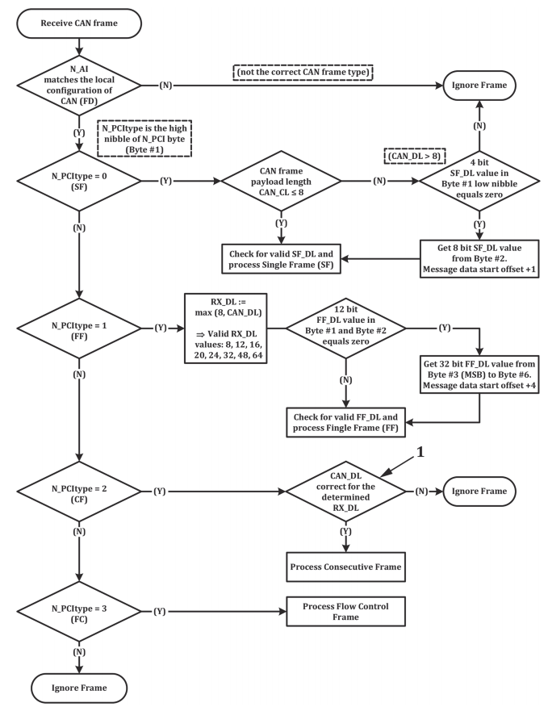
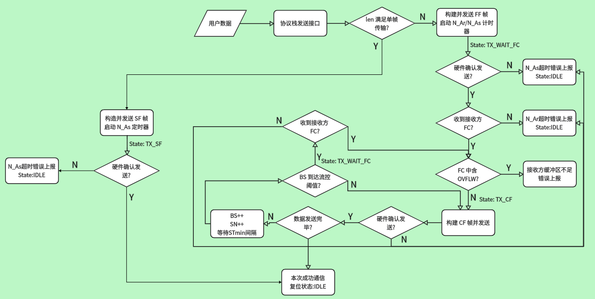
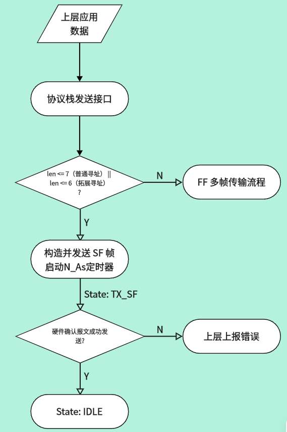
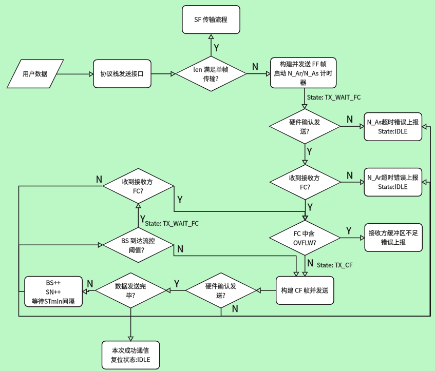
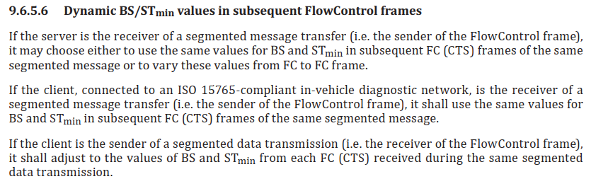
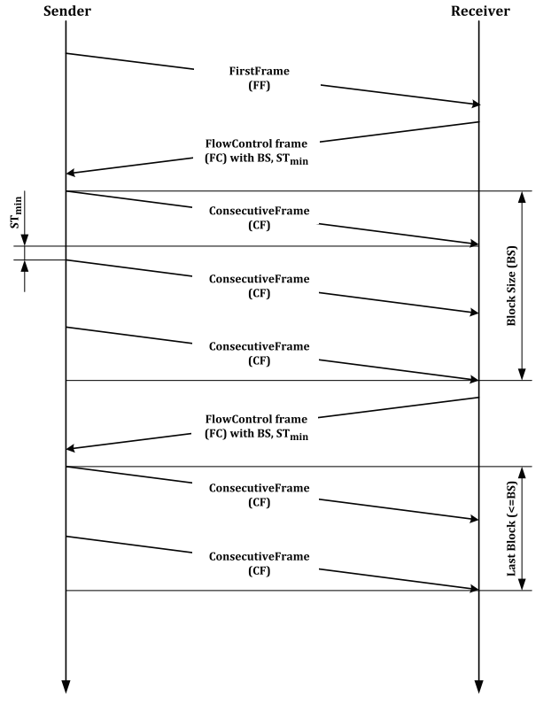
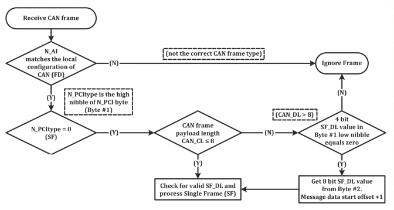
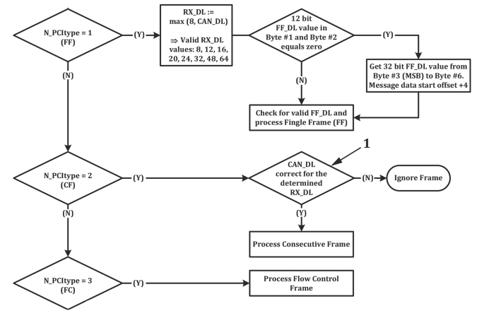

在上篇中（）我们详细介绍了 iso-tp 中的基础通信数据元（PDU）以及寻址模式，这些内容指导了我们 CAN 报文的组装方式。在下篇中，我们将在前述的基础上，详细讲讲 iso-tp 的状态机流转过程，帧是怎么发送的，时序上有哪些要求。

这里先给两个总状态机流转图：

(一) **iso-tp 接收流程状态机(源自 ISO 15765-2:2016)**

**(二) iso-tp 发送流程状态机**

后续我们将以该两图为基础，详细拆解其各个状态。

------

### 发送状态机

#### 单帧传输

iso-tp 是具备单帧路由机制的。当待发数据量 <= 7字节(普通寻址模式/Classic CAN为例) / <= 6字节(拓展寻址/Classic CAN 为例)时，我们一个报文就可以将所有的数据全部打包带走，没有必要启动多帧传输。协议栈内部在满足上述条件后，会直接走单帧发送路径。以下是 SF 单帧传输的状态流程：

协议栈内部判定该包数据长度能够在该寻址模式下，通过一个 CAN 报文全部打包带走时，便会将待发送数据路由给单帧发送机制。单帧发送机制会构建 SF 类型的报文，向总线发出，并且在提交发送请求后会立即开启硬件定时计时器 N_As。此时连接控制块状态为 `TX_SF` 。

当 CAN 控制器成功发送出该帧报文时，将关闭定时器，并且复位状态为 `IDLE` 空闲状态。以此就完成了一次 SF 单帧的通信。当硬件因为某些原因没有发送出报文进而导致定时器超时后，协议栈应该通知上层，向上层上报错误，由上层来决定是否重启通信。

------

#### 多帧传输

iso-tp 中，可靠的多帧重组传输机制才是协议的一大亮点。多帧传输是由 FF + CF + FC 共同构成的一个稳定的传输状态机，以下是多帧传输下的状态机流转图：

**当协议栈发现要传输的数据量大于单帧所能承载的容量时，此时便会触发多帧传输**。

其具体流程为：

- **构建 FF 帧，用于启动一次多帧传输**。

将 PCI + FF_DL + 首段数据(此处示例为 <= 4095 的情况，若 > 4095 且为 Classic CAN，因长度字段占据大量空间，FF 通常不携带有效数据，所有数据均从后续 CF 开始发送。) 打包进CAN报文中，并正确填充 TA/SA/TAType 等信息，提交硬件发送，并启动 N_Bs（流控超时计时器）与 N_As（硬件计时器）。此时状态由 `IDLE` 转为 `TX_FF`，当硬件发送确认后，N_As被关闭，状态转为 `TX_WAIT_FC`，等待接收方发回流控FC。
此时 N_Bs 计时器依然运行，用于监控接收方发回流控这一操作是否超时。

- **收到接收方发回的 FC ，更新本次传输流控参数，停止 N_Bs 定时器。**

收到 FC 之后，若收到的是 WAIT 流控，发送方不应停止 N_Bs，而是重启该定时器继续等待下一个 FC。其它情况下协议栈应该停掉并重置 N_Bs 计时器，同时将收到的 FC 中的流控参数(STmin/BS)以及流控状态提取出来。若对端返回 OVFLW 状态，表示缓冲区不足，应当终止本次传输。
在后续通信中，发送方将严格遵循 FC 中的 STmin（两个CF之间最小帧间隔）与 BS（块大小）的约束进行 CF 的发送。

这里有些细节要强调一下：

1. STmin/BS 是允许均为0的，代表全速发送，要注意接收方处理速度能否跟上。
2. 关于 FC 流控机制，标准里面给出了两种解释，详见下图：
   

iso-tp 允许接收方在同一个多帧传输过程中动态调整流控参数。也就是说，流控机制分为了静态流控与动态流控，不同的工程背景可以选用不同的流控机制。

**动态流控**：接收方在**同一个多帧传输**的不同流控帧（FC）中，可以改变 `BS` 和 `STmin` 的值（比如第一次 FC 告诉你 BS=5，下一次告诉你 BS=3）。也就是说，iso-tp 允许服务器根据负载动态掌控流控，如果服务器是分段消息的接收方，那么可以自由选择保持 BS/STmin 不变，或者在同一个多帧传输中改变这些值。

例如服务器 CPU 负载变高时，可以将流控缩小甚至关闭（发送Wait流控），以免缓冲区溢出。当空闲时再打开流控接收分段数据。

**静态流控**：在**同一次多帧传输**的所有 FC 帧中，BS 和 STmin 要保持不变。也就是说该次通信的流控取决于第一次发送给对方的流控，后续均基于这个流控参数的基础上进行通信。

这个流程中，**流控主导权在接收方**，发送方被迫适应。

在我的轻量化实现中，对于这个部分我是统一采用静态流控的。因为常规 MCU 之间的通信大部分情境下都不会使用到该功能，为此在发送方引入一个解析功能没必要。

- **根据流控参数发送连续帧 CF。**

从发送缓冲区中取出下一段待发数据，打包成 CF 帧向总线发出，并启动N_As等待控制器成功发到总线上后响应。在整个 CF 发送期间状态机都应该保持 `TX_CF` 状态。

同时，SN 序列码要递增，这是协议栈判断是否帧错位的重要依据。上一篇文章我们已经阐述了 SN 序列码的作用，此处仅简单提一下要点即可：**一定要注意 SN 码是模16循环**！因为 SN 的占位只有4位大小，如果忘记循环那么通讯将在第一次 SN 码触发临界时断裂，尤其要注意！

由于流控的作用，每帧 CF 之间需要间隔 STmin。且如果当前BS块发完（仅在 BS > 0 条件下）的话，需要回到 `TX_WAIT_FC` 状态，等待接收方通过流控 CTS 下发下一次的发送许可。

CF 发送的整体流程如下图所示：

图片内容展示了多帧传输 + 流控场景下的数据收发示意图。重点理解 BS与STmin的概念。

- **数据发送完毕，传输结束**

当最后一包 CF 发出后，协议栈内部判断读指针已经来到待发数据末尾，说明当前整个缓冲区数据已被发出。此时发送方将状态从 `TX_CF` 切换为 `IDLE` 空闲状态，通知上层传输完成（可通过回调等形式）并清扫连接内部的相关字段，为下一次通信做准备。

值得注意的是，iso-tp 与 IP 协议类似，只尽最大努力路由数据，至于对端是否接收到是不会管的。没有应用层的 ACK 确认机制（对端是否完全正确接收与组装不会发一帧报文来通知你）。

------

### 接收状态机

#### 单帧接收

当协议栈接收到一帧 iso-tp 报文后，会取出 PCI 信息字节的高四位：**帧类型识别码**。若识别码为 0（即下图中 N_PCItype = 0），则表示该帧为 SF 单帧，走单帧处理流程。

- **检查接收的CAN报文数据段是否 <= 8字节.(Classic CAN)**

若数据长度 ≤ 8：可能是 Classic CAN，也可能是短 CAN FD，但两者 SF 格式一致，直接按 SF_DL 解析即可。此时若 SF_DL = 0，属于非法格式，按错误帧处理。

- **若数据段 > 8字节，检查是否为 CANFD 的有效 SF 报文.**

数据长度 > 8 时，必然是 CAN FD，且数据长度已超过短格式范围，因此必须使用扩展 SF_DL 格式：第一字节低 4 位（原 `SF_DL`）为 0，真正的长度在第二字节。

对于原4位 `SF_DL` 不为0的情况，当作错误帧进行处理（忽略）。

------

#### 多帧接收

当协议栈收到帧类型识别码为 1 的报文时，表示接收到了一帧 FF 首帧。收到 FF 即表示一次多帧通信即将开始，接下来就是完整的多帧通信状态机。

- **收到 FF 后，提取 FF_DL，回复流控。**

收到一帧 FF 后，状态变为 `RX_FF` 。协议栈应提取出该报文中的 `FF_DL`，检查自身缓冲区是否足以容纳本次通信数据量（流式传输除外），以明确本次通信所要传输的数据量大小；提取出可能存在的由 FF 帧带来的部分数据；同时也要提取出发送方 SA 地址，便于后续回复流控。

所有数据提取后，根据自身设置，构建 FC 流控帧发往对端，同时启动 N_Cr(监控发送方是否按时发来下一个 CF) 与 N_Ar 计时器(监控 FC 是否被硬件成功发出)。FC流控成功被硬件确认后，此时状态变为 `RX_CF` ，准备接收接下来的 CF 数据包。

- **CF 数据包接收。**

这里接收部分需要涉及到 **SN 连续性检查**，首帧隐含 `SN = 0`，因此收到的第一个 CF 期望 `SN = 1`。

若 `SN` 与期望值匹配 ，数据存入缓冲区，期望 SN 递增（模16循环）。

若 `SN` 不匹配（期望2却收到3） **丢弃该帧，保持当前状态，等待 N_Cr 超时后回到 Idle 状态并等待下一次 FF**。标准规定此时接收方不主动发送错误码，沉默等待即可。

每收到一个 SN 匹配的 CF 都要重置 N_Cr 定时器。

- **流控参数：BS**。

若 BS != 0，则作为接收方，当BS阈值到达时，状态转换为 `TX_FC` 需要向对端发送一个 FC 报文。这里如同上文所述：分为**静态流控**与**动态流控**。具体怎么使用取决于你的工程实现。

- **接收完成。**

当累积的接收数据 == `FF_DL` 时，此时可认为已经收到完整的数据。协议栈应停掉 N_Cr 定时器，

状态回到 `IDLE` 空闲，并将完整的数据交付给上层（通过回调或消息队列）。最后打扫控制块中的对应字段，为下一次通信做准备。

整个流程中，对于 N_Cr 超时，接收方应丢弃已重组数据，状态回到 `IDLE`，并通知接收方上层。接收方不主动请求重传；是否重新发起多帧传输由发送方决定。

发送状态机与接收状态机其实是对称的：发送方在 `TX_WAIT_FC` 等流控，接收方在 `RX_CF` 等连续帧；发送方关心 `N_Bs`（等 FC），接收方关心 `N_Cr`（等 CF）。两者通过 FC 帧中的 `BS` 和 `STmin` 完成节奏协商，共同保证多帧数据在 CAN 总线上的可靠重组。

------

### ISO-TP 定时器汇总

前面多次提到了定时器，这里给出 iso-tp 中的一些相关定时器以及分工表：

| 定时器     | 生效方     | 全称               | 启动时机                                              | 停止时机                                          | 超时后果                                     |
| :--------- | :--------- | :----------------- | :---------------------------------------------------- | :------------------------------------------------ | :------------------------------------------- |
| **`N_As`** | **发送方** | 发送方硬件确认超时 | 每提交一帧（SF/FF/CF）给 CAN 控制器后                 | 收到 CAN 硬件发送完成中断（ACK）                  | 发送方传输中止，向上层报错                   |
| **`N_Ar`** | **接收方** | 接收方硬件确认超时 | 每提交一帧（FC）给 CAN 控制器后                       | 收到 CAN 硬件发送完成中断（ACK）                  | 接收方终止接收，向上层报错                   |
| **`N_Bs`** | **发送方** | 流控等待超时       | 发出 FF 后；每发完一个 BS 块后                        | 收到 CTS/OVFLW 时停止；收到 WAIT 时重启继续等待。 | 终止多帧传输，向上层报错，状态回 `IDLE`      |
| **`N_Cr`** | **接收方** | 连续帧等待超时     | 发出 FC 后（等待第一个 CF）；每收到一个有效 CF 后重置 | 收到满足 `FF_DL` 的最后一个 CF                    | 丢弃已重组数据，状态回 `IDLE`，等待下一次 FF |

- **N_Ar / N_As**

两个都是**记录底层硬件发送行为**的计时器。区别在于 N_Ar 是接收方等硬件，N_As 是发送方等硬件。

比如对于 N_As ：“我发了，但是这帧有没有从总线上真正发出去？”不得而知，只有等硬件确认。

对于 N_Ar：“我回了 FC，但是有没有真正发出去？” 等硬件确认。

在我的实现中，这两个定时器我统一合并为了一个 N_As，并在 CAN 发送完成中断中进行状态推动。

- **N_Cr / N_Bs**

这两个是**记录软件层行为**的计时器。

对于 N_Cr ：这是接收方等待 CF 的定时器——"对方软件到底什么时候给我发下一个 CF？"

对于 N_Bs：这是发送方等待接收方发来的 FC 的定时器——"对方软件到底什么时候回我 FC？"

这些定时器交织起来共同组成了一个超时网络，确保协议栈在通信的每一步都不会卡死，能够超时回退。

------

至此，iso-tp 的核心流程已经完结，从4个PDU到寻址模式，再到协议栈定时器与运行状态机。后续若有关于 iso-tp 的其它内容，将作为拓展单独篇幅叙述。
