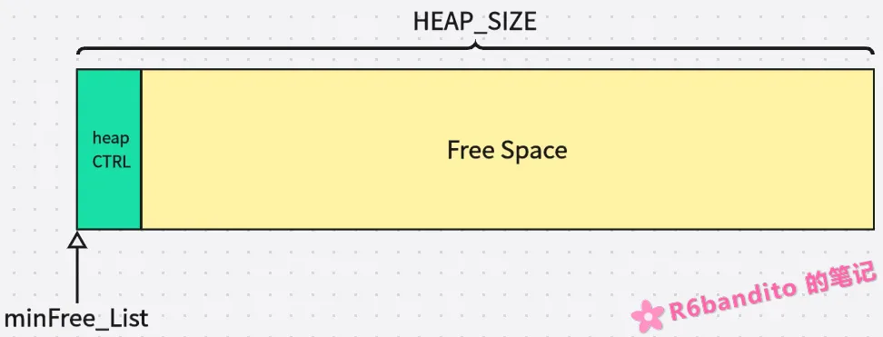

#### 引言

日常开发中，内存的管理自然是不可或缺的一环。例如 Ethernet 中要发送数据包要开辟发送缓冲区，接收数据包时要开辟接收数据包，并且使用完毕后需要及时归还，以免出现内存泄漏。这些操作均离不开一个可靠的内存管理机制。

标准C中已经给我们提供了一套由用户自行管理的内存分配机制，也就是我们常说的堆内存heap（动态分配机制）。但是由标准C提供的这一套机制在嵌入式开发中风险是比较高的，其中主要来自以下几个方面：

- **不可重入特性**：如果被竞争访问有很大风险会造成堆结构损坏，堆链断裂。在一些中间件的改造中(例如 FreeRTOS heap_3) 可能解决了这个问题，但是这仅仅只是取决于一些三方的实现。
- **容易造成碎片化**：标准C实现是没有前后相邻块合并吞食的，这也就意味着在大量分配与释放的操作下，产生微小难以利用的内存碎片的概率很大，导致程序不稳定。
- **内存位置由链接器强行绑定**：标准 C 的堆只有一个——就是由链接器分配的那块。如果想要管理例如 CCM_SRAM这类内存，那么标准C这套管理方法完全无法使用。

因此在很多情况下，嵌入式中的动态内存分配是被完全禁止的。这就需要我们手动打造一套自身的嵌入式专用的内存管理机制。

------

#### 什么是内存堆？

常规的内存管理机制有 **内存池**、**内存堆** 等实现，内存堆其本质就是：**在局部开辟一块巨大的静态内存数组，然后在这块数组之上，自行实现一套分配、释放、合并的规则**。

```c
/* 后续的所有内存堆逻辑都是基于该块内存空间上展开. */
static uint8_t __attribute__((aligned(ALIGNED))) ucHeap[HEAP_SIZE];
```

和内存池区别在于内存堆能够精细把握块粒度，而内存池只能够固定大小分配。

------

#### 内存堆思想

内存堆的实现有多种变体，这里只阐述我常用的 `First Fit(首次适配) + 前后合并` 的设计模式。

这里需要先了解一下内存堆是怎么向用户划分空间的基本流程：

- **用户调用 `alloc()` 向管理器请求一块内存。**
- **内存堆内部开始遍历所有内存块，直到找到第一块内存空间 > 请求空间的空闲内存**。
- **将该块空间取出，将用户所需部分取出标记使用后返回给用户；多余部分返回给内存堆中。**
- **用户使用完毕后，将空间返回内存堆中，合并前后可能的空闲块，并标记空间空闲。**


##### 块头结构

要进行管理，自然离不开对应的数据结构。块头结构就类似于”身份证“，每一块空闲或是正在被使用的内存块都需要维护一个该结构，以便管理逻辑能够正确找到它。其内部包含的元素通常需要含有如下几个：

- `块大小(BlockSize)`：这一块空间有多大？用于计算下一块的地址以及与用户申请空间做判断。
- `next、prev 双向指针`：双向指针是必须的，用于前后合并以及内存堆遍历时的正向索引。
- `使用标志(used)`：这块内存目前是正在被使用还是空闲？要弄清楚这个状态我们就必须维护一个使用标记。这个标记也是我们后续分配以及前后合并时的一个重要参考。

综上所述我们可以拿出如下一个数据结构：

```c
typedef struct heapCtrl {
	uint32_t blockSize;
	uint32_t used;
	struct heapCtrl *next;
	struct heapCtrl *prev;
} heapCtrl_t;
```

这里先记住这个结构，后续我会画图来进行阐述，这个结构尤其重要！

（Ps：这里有个细节要说明一下：尽管used的含义只是布尔型变量，但是此处要使用u32，目的在于结构体内存对齐，便于后续的地址计算。 在MCU中非对齐地址访问风险是很大的!请则降低效率,重则直接硬件错误）

------

##### 快速索引

接下来我们还需要一个快速索引（不知道这么叫是否合适，但是作用确实是提高效率），这个索引我来打个比方：在TCP/IP 的大部分实现中，网络层在查ARP表时往往会全局维护一个最近一次命中的IP地址。这样当我下一次向相同IP发包时，就不需要再去遍历ARP缓存表，而是直接一次命中！这就是我们所谓的**缓存命中**。

同理，我们在此处的索引也是这个道理：**假如我们每次请求内存都从数组头开始逐块遍历，那其实效率是比较低的。我们维护一个变量专门指向当前最低地址的空闲块，那么后续遍历直接从该块开始向后遍历，就能提高不少效率**。

这个全局索引我们这么来设计：

```c
static void *minFree_List = NULL;
```

- 分配时，从该地址开始后向遍历（该地址前面全是已经使用了的，没必要跑一遍）。
- 释放时，若新空闲块地址 < 索引，则更新索引。

------

##### 分配策略

这里来谈谈分配策略。我在之前已经说过，内存堆的实现不是唯一的。在这里，内存堆关于分配算法的实现主要有以下几类：**首次适配（First Fit）**、**最佳适配（Best Fit）**。其中

- **首次适配**：**从头开始，找到第一块够大的就行**。这是嵌入式里面的经典实现，FreeRTOS的heap_4以及lwIP的内存堆实现采用的都是首次适配的方法。这个方法速度快，而且实现简单，缺点就是在低地址空间中容易形成碎片。
- **最佳适配**：**遍历整个链表，找“刚好够用且最小”的**。这个方法优势很明显，碎片少；但是缺点也显而易见，时间复杂度更大，而且会产生更小的碎片。在FreeRTOS的heap_2中使用的就是该方式（目前heap_2已被heap_4全面替代）。

我们本文讲解与使用的正是 **首次适配**(First Fit)的方式。

------

##### 分裂与合并

**分裂**

这是整个内存堆分配与回收的流程。上述我已经简述了分配的一个基本流程，此处不再赘述。直接上图能更加形象的呈现整个流程：

1. 刚初始化时，整个内存堆都是空闲的。此时内存结构如下图所示：



其中，heapCTRL为内存块控制头，由于刚初始化没有产生过分配行为，因此只有一个控制头控制着 

`(HEAP_SIZE - sizeof(heapCTRL))`大小的空闲内存块。

2. 我们向初始化后的内存堆请求一块Size大小的空间。内存堆状态如下


看到了吗？我们请求一块Size大小的空间，首次分配从整个Free Space中划出来了一块Size大小返回给用户，**同时检查剩余空间是否足以容纳下一个控制头**（`heapCTRL`）**以及最小数据块**(`Minimum_Heap_Size`)。如果能够容纳，那么剩下部分被打上控制头后返回给内存堆中，供下一次分配使用。

这里提一嘴为什么需要设置`Minimum_Heap_Size`门槛：这是为了防止内存被割得太碎进而无法有效利用。如果当前遍历到的这块空闲空间，划分后剩下部分已经不足以维持一个控制头和最小数据块，那就索引整个分配给用户，不再切割了。

由于已经发生分配行为，因此我们的`minFree_List`也得更新到最低地址的空闲块，下次分配行为直接从`minFree_List`处开始，不再从头开始遍历。

```c
	if ( (ALIGNx((mark->blockSize - need)) >= MIN_HEAP + sizeof(heapCtrl_t)) )
		split = 1;
	
	if ( split )
	{
		heapCtrl_t *new = (heapCtrl_t *)(((uint8_t *)mark + sizeof(heapCtrl_t)) + need);
		new->blockSize = (mark->blockSize - need - sizeof(heapCtrl_t));
		new->next = mark->next;
		new->prev = mark;
		mark->next = new;
		if ( new->next != NULL )
			new->next->prev = new;

		new->used = 0;
		mark->blockSize = need;
	}
	mark->used = 1;

	if ( minFree_List == (void *)mark )
	{
		heapCtrl_t *q = mark->next;
		while ( q != NULL && q->used )
			q = q->next;
		minFree_List = (void *)q;
	}
```

上面是该段过程的一个参考实现。关键的部分已经给出注释，此处不再赘述。

------

**合并**

