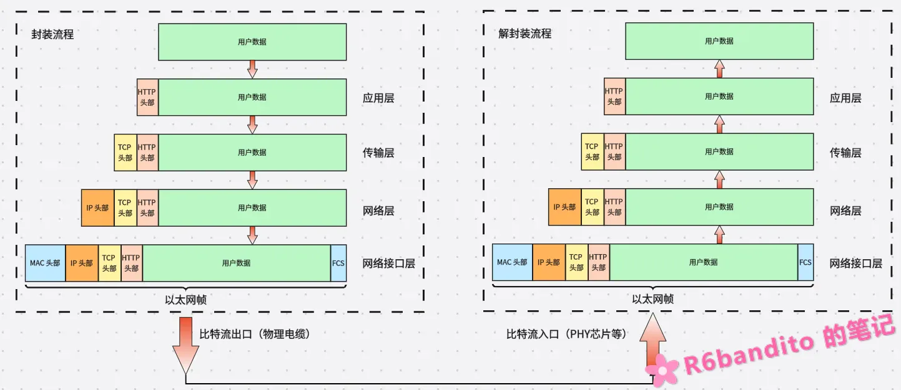

#### OSI 七层模型

OSI七层模型，全称是开放系统互连参考模型。是国际标准化组织提出的一个用于管理网络通信的网络分层模型。

如下表所示，OSI模型十分详尽，理论背书充足。但是也正是因为过于理论这个原因，其实现十分复杂，缺乏实际落地应用的基础，且有的层次划分不尽合理。

所以在**应用方面实际被广泛使用的是TCP的经典四层模型**。

实际学习中，对于七层理论模型了解一下即可。

| 层级  | 名称       | 核心功能                  | 常见协议/设备        |
| :---- | :--------- | :------------------------ | :------------------- |
| 第7层 | 应用层     | 为用户提供网络服务接口    | HTTP、FTP、SMTP      |
| 第6层 | 表示层     | 数据格式转换、加密、压缩  | SSL/TLS、JPEG、ASCII |
| 第5层 | 会话层     | 建立、管理、终止会话      | NetBIOS、RPC         |
| 第4层 | 传输层     | 端到端可靠传输            | TCP、UDP             |
| 第3层 | 网络层     | 路由选择、逻辑寻址        | IP、ICMP、路由器     |
| 第2层 | 数据链路层 | 帧封装、MAC寻址、差错检测 | 以太网、交换机、PPP  |
| 第1层 | 物理层     | 比特流传输、电气特性      | 网线、光纤、集线器   |

------

#### TCP/IP 四层经典模型

TCP/IP 四层模型才是真正的重头戏。与OSI理论模型不同，TCP经典模型是在不断的实践运用中逐渐积累起来的。主要分为以下几个层次：

| 层级           | 对应 OSI 层 | 核心功能   | 常见协议             |
| :------------- | :---------- | :--------- | :------------------- |
| **应用层**     | 5+6+7       | 用户服务   | HTTP、FTP、DNS、SMTP |
| **传输层**     | 4           | 端到端传输 | TCP、UDP             |
| **网络层**     | 3           | 路由寻址   | IP、ICMP、ARP        |
| **网络接口层** | 1+2         | 物理传输   | 以太网、Wi-Fi、PPP   |

- **应用层**：囊括了理论模型的会话、表示层，统一收拢到应用层中。常见的上层应用协议（例如HTTP、MQTT、DNS等等）均在此层
- **传输层**：这和理论模型第四层是相同的，TCP/UDP的“老巢”，负责端到端（你也可以理解为 进程-->进程）之间的数据包寻址。 
- **网络层**：同理论模型第三层，主要是IP协议，规定了数据包怎么走，走哪条路。该层还包含了ARP与ICMP等等次生协议用于辅助通信。
- **网络接口层**：对应理论模型的1、2层。负责将数据变为光电信号发出，网卡驱动以及物理线缆都属于这一层的范围。

总的来说，TCP/IP 四层把 OSI 的上三层（会话、表示、应用）合并成应用层，下两层（物理、数据链路）合并成网络接口层。这不是简单的“压缩”，而是**按实际工程需要重新划分**——OSI 的会话层和表示层在实际协议栈中几乎没有独立实现，它们的功能被直接塞进了应用层协议里（比如 TLS 做加密、HTTP 管会话）。

#### 数据封装与解封装流程

四层模型每一层都对应这一个封装与解封装的过程：

- **对于发送方而言，由应用层开始从上至下，每经过一层就加上该层的头部（或尾部），这个过程就叫封装**。
- **对于接收方而言，由物理层（接口层）开始从下至上往上递交，每经过一层都要剥去该层的头部（或尾部），这个过程叫解封装**。

所以总的来说，分层的本质是：**各层只关心自己的头部，只根据自身的头部进行对应操作，而不关心其它层的内容**。其它层的内容相对于它们就视作普通数据负载。

以下是以HTTP为例的以太网数据包封装与解封装示意图：

发现了吗，封装流程与解封装流程基本上是一样的，只是方向不同罢了。

在传输过程中，传输层的PDU单位叫作“段”，也就是我们说的TCP报文段；网络层单位叫作“包”，IP数据包；在接口层叫作帧，以太网帧。了解一下就好。

关于数据发出与接收的详细流程，本文不做阐述，这些细节将在其余文章进行单独叙述。

**为什么工程上用 TCP/IP 而不是 OSI？**

因为OSI 是“**先定标准，再写实现**”，TCP/IP 是“**先有实现，再总结标准**”。这就导致：

- OSI 的协议栈复杂、层次过多，实际部署极少；
- TCP/IP 经过 ARPANET 和互联网几十年实战检验，实现轻量、兼容性好；
- 但 OSI 的分层思想被 TCP/IP 完整继承——所以我们理论研究时可以用 OSI 进行阐述和理解，但是落实到实际工程中要用 TCP/IP 。
