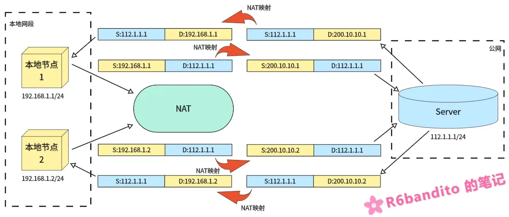
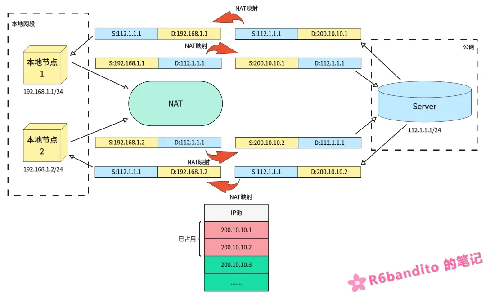
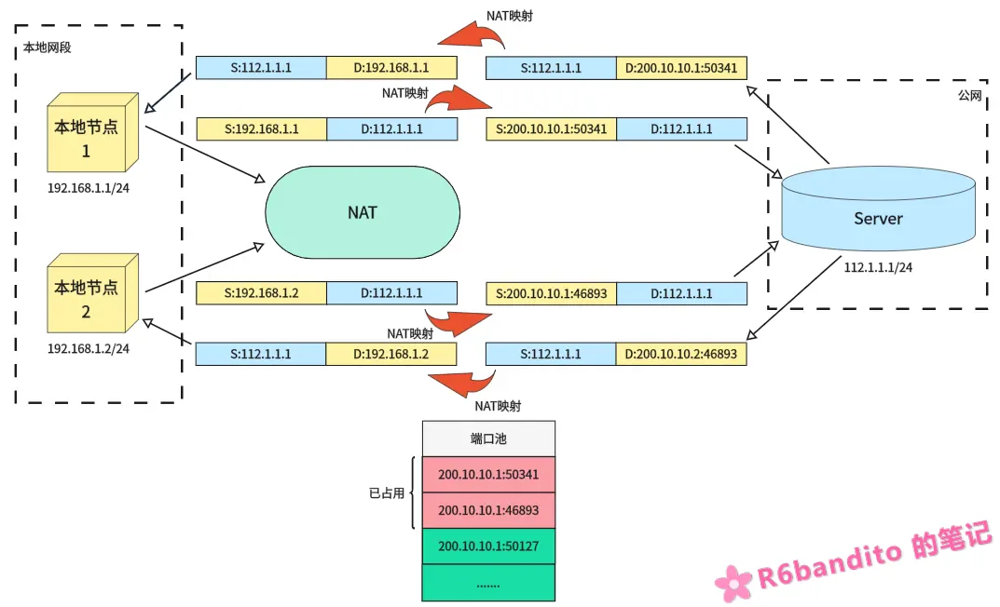

#### 引言

在网络通信中，IP地址是不可或缺的一环，无论是什么通信方式，均离不开IP地址。目前主流的IP地址协议为`IPv4`，一个IPv4地址由32位二进制组成，在表示上采用点分十进制的拆分成四段进行表示。让我们来计算下拢共有多少个IPv4地址可供分配：`2^32 - 1 ≈ 42.9亿`，考虑到网络地址、广播地址、保留地址等开销，实际可供分配给主机的地址还要更少。

在当今互联网飞速发展的情况下，IPv4地址已经枯竭，`IPv6`虽然可以从根本上解决IP地址不足的问题，但是目前仍有多数网络设备是基于IPv4的，因此在这个过渡期间就必须得有一个对应的技术来暂时解决这个问题。

NAT(Network Address Translation) 网络地址转换技术正是于此背景之下诞生的。该技术使每个网段更加独立：也就是网段内部私有域中的设备不再能够直接与互联网通信，而是必须走网关通过NAT转换之后才能与外部互联网建立通信。

**NAT 技术就是在私网地址与公网地址之间相互转换的**，说准确点就是：NAT 技术通过在网关处修改 IP 包的源地址或目标地址，实现私网与公网之间的地址映射。

**多个私网地址可以共用一个公网地址**，这样即保证了网络通信，又节省了公网地址，这就是NAT的优点。

------

#### NAT 做到了什么?

这里需要先声明一点：`NAT != 网关`。NAT与网关是**包含关系**——NAT是网关的一个功能子集。网关除了NAT之外，还能集成 DHCP、DNS、防火墙等网络与安全服务，不能简单认为NAT就是网关。

- **NAT 让内网与公网之间无法直接互访**。**内部私有 IP 地址对外不可见，天然隐藏内网拓扑。外网在没有端口映射的情况下无法主动连接到内网设备。**
- **NAT允许灵活组网。私网段用户可以随意使用，本地局域网段无需申请公网IP，就算发生冲突也只限于该网段内部。**
- **极大节省公网IP。通过NAPT技术，一个公网IP可以让数十台，甚至上百台设备同时上网。**

目前只要是接入了互联网的网关设备，大部分都集成了NAT技术。

当然，NAT的引入也带来了一定的副作用：

破坏了端到端的通信，增大了网关的负载，也使得P2P通信更加困难。以部分联机游戏举个例子，有的游戏提供 `P2P` 联机模式，理想情况下，联机双方设备只需要知道对方的IP和端口就能够发起直连，这是双向对称的。

但是，当处于NAT环境下时，由于双方的NAT类型和严格程度不同，所以很可能会出现A发往给B的包，在NAT处被丢掉或反之同理。这就是NAT引入之后带来的不便。

这里附一个常用私有地址域范围表：

|  类  |           地址范围            |      CIDR      |
| :--: | :---------------------------: | :------------: |
|  A   |   10.0.0.0 - 10.255.255.255   |   10.0.0.0/8   |
|  B   |  172.16.0.0 - 172.31.255.255  | 172.16.0.0/12  |
|  C   | 192.168.0.0 - 192.168.255.255 | 192.168.0.0/16 |

这三类地址是全球公认的私有地址，本地网段中想怎么使用都行。即使两个不同的公司内部都用了 `192.168.1.0/24`，只要他们不直接合并网络，就绝不会冲突。

并且这三类地址也是不可直接路由的，任何公网核心路由器只要看到目标是这三类地址其中之一，就会直接丢弃数据包。所以这些地址只能在局域网内“自娱自乐”，上网必须经过NAT转换。

------

#### NAT 的类型与工作原理

##### 静态NAT

静态NAT的规则很简单：**永久将一个内网私有地址映射到一个公网地址**，每个映射在配置时都是写死在NAT表中的。

如下图所示：

我们有两个本地设备分别为 `192.168.1.1/24` 与 `192.168.1.2/24` 需要上网，在静态NAT的规则下，节点1发送出的数据包(S:192.168.1.1/D:112.1.1.1) 经过网关NAT映射后，永久绑定了一个公网IP：`200.10.10.1`。Server侧收到的是`200.10.10.1`发来的数据包，当Server要向节点1回复时，是向`200.10.10.1`这个地址发送数据而不是向`192.168.1.1`直接发（如果这么发就发到服务端侧自己的本地网段中其它设备去了，很明显错误）！

Server回复的数据经过NAT重映射之后，目标IP从`200.10.10.1`被网关修改为了`192.168.1.1`，随后数据被路由给节点1，正确接收。节点2的收发流程也是同理。

在本例中：`200.10.10.1` 与 `200.10.10.2`这两个公网IP将被节点1和节点2永久占用。

也就是说一个设备吃掉一个公网IP，这是极其浪费的一种行为。**因此静态NAT模式通常用于服务器这些需要对外提供服务的设备（作为服务器必须保证地址稳定可连接）**。

------

##### 动态NAT

动态NAT维护有一个IP地址池，该池中是目前空闲可使用的公网IP。其本质就是：**从地址池中进行动态分配，谁先上网就先优先分给谁使用，用完后释放**。

动态NAT和静态NAT流程上有相似之处。上例中，我们IP池中原本有 `200.10.10.1~x` 个空闲公网IP，节点1与节点2都需要上网，因此`200.10.10.1`被分配给了节点1，`200.10.10.2`被分配给了节点2。

**与静态NAT一样，动态NAT一个公网IP一次只能服务一台设备**，因此池中前两个IP被占用，假如此时节点3上线需要进行通信，那么节点池会将空闲的`200.10.10.3`分配给节点3使用。当地址池被用尽后，只能等待被占用的公用IP被释放后，其他主机才能使用它访问公网。

对于动态NAT而言，其实并没有解决公网IP浪费问题，因为本质上依然是一台设备对应一个公网IP。动态NAT定位十分尴尬：它比静态NAT省一点，但没省到点子上；比NAPT差很多，却没有任何额外优势。在NAPT普及后，纯动态NAT已很少单独使用。

------

##### NAPT(端口地址转换)

NAPT技术也叫做端口多路复用，是目前应用最广泛的NAT技术，也是最需要仔细了解的技术。NAPT与静态NAT/动态NAT不同，**能够真正做到一个公网IP同时使数十台设备同时上网**。

其原理是：**使用传输层端口号区分不同的内网主机和会话，所有内网设备共享一个（或少量）公网 IP，通过不同的源端口映射出站连接**。

你比如两台本地设备分别被映射到了公网IP `200.10.10.1:50341` 和 `200.10.10.1:46893`，两台设备使用的都是 `200.10.10.1`这个公网IP，但是流量被接入到了不同端口。若公网Server需要向其中一台设备通信，则只需要向  `200.10.10.1:50341/46893` 这两个端口发送数据即可。目的IP都是一样的，但是端口号为50341的流量会经NAT转换后被网关路由给设备1，端口号46893则路由给设备2。

具体见下图：

示例中，节点1与节点2分别被分到了公网IP`200.10.10.1`的50341与46893端口，这两个设备通过一个公网IP上网。当Server回复50341端口时，其数据包来到网关处，NAT查表得到50341映射为本地 `192.168.1.1:x` 的设备，随后NAT将包中的公网地址修改为本地的地址，交给网关路由到对应设备。整个流程下来Server向`200.10.10.1:50341`这个地址的回复数据包就被我们本地`192.168.1.1:x`正确接收到了。

节点2以及其它更多节点的通信都是同样的道理。

------

#### 三种类型之间的简单对比

| 类型         | 映射关系     | 是否改端口 | 公网 IP 消耗 | 典型场景             |
| :----------- | :----------- | :--------- | :----------- | :------------------- |
| **静态 NAT** | 一对一，永久 | 否         | 1:1，最浪费  | 对外服务器           |
| **动态 NAT** | 多对多，动态 | 否         | N:M，较浪费  | 企业内网             |
| **NAPT**     | 多对一，动态 | **是**     | N:1，最省    | 家用路由器、手机热点 |
