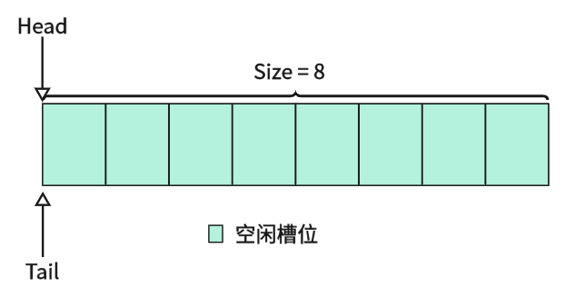
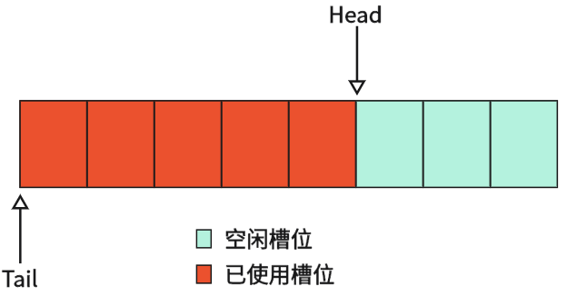
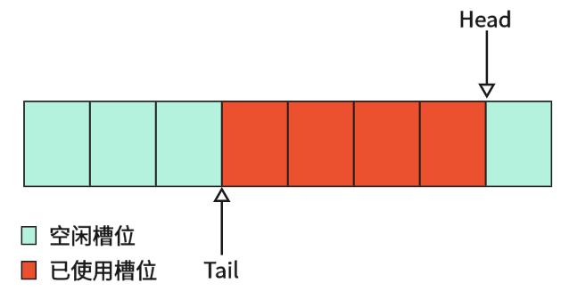
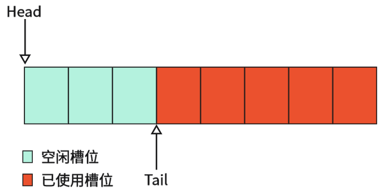
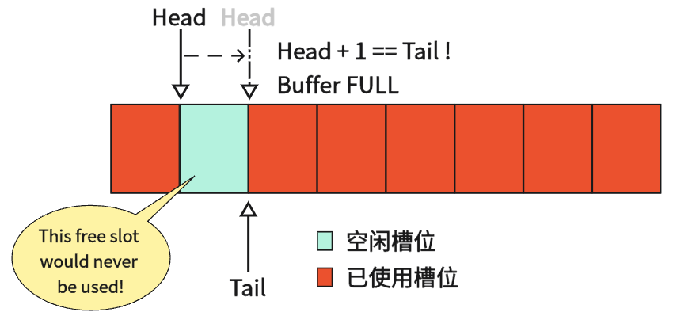

#### 什么是环形缓冲区?

嵌入式C中，环形缓冲区是一个**基于数组的简单可靠的环回线性数据存取结构**。核心是通过一个写指针(我习惯叫head)，一个读指针(tail)管理数据的写入和读取，并用循环取模或位与等操作实现回绕的特性。环形缓冲区解决了传统线性缓冲区频繁分配与释放导致的内存碎片、效率低下等问题。

接下来给一个简单流程示意图例：

- **初始时，读写指针均位于缓冲区起始，此时缓冲区为空状态**，如图



- **数据由`Head`写入，写入后`Head`索引移动到下一待写入位置。**



- **缓冲区中数据由`Tail`读出，读出后`Tail`索引移动到下一待读取位置**。



- **`Head`写满后回绕到缓冲区起始，`Tail`同理**。



以上便是环形缓冲区正常工况下数据存取的一个简单模型。内部一些具体细节将在下文展开，上述流程只是为了简单了解下环形缓冲区的工作原理。从上述可看出：

1. **环形缓冲区本质是一个FIFO队列，先进先出**。
2. **读写数据时间复杂度均为O(1)，无需移动任何数据**。
3. **读写索引到缓冲区边界后自动发生回绕**。

环形缓冲区是嵌入式系统中十分重要且常用的一个数据结构，在**串口收发场景**；**DMA数据缓冲场景**；**传感器数据缓存场景**等均有很广泛的运用。

------

#### 环形缓冲区的数据结构

要设计一个环形缓冲区，有3个要素是必须的：

- **缓冲区数组**：这就是我们的缓冲区物理空间，后续我们所有的操作均基于该缓冲区上进行。
- **读/写索引**：环形缓冲区灵魂所在，利用两个索引的平移和回绕在线性数组上天然实现环形特性。注意我们这里一直说的是“索引”，所以本质其实应该是一个u16/u32变量，不要定义为指针类型复杂化问题！

这里提前说明一下：还有一个要素是 **有效数据长度** ，但是该要素是否必须取决于你的缓冲区实现策略，这里我使用的是**牺牲槽判空法**的策略，因此不需要该元素。

通过上面的叙述，我们可以定义出一个结构如下：

```c
#define RING_BUF_SIZE	(64u)
typedef struct {
    uint8_t buffer[RING_BUF_SIZE];	/* 缓冲区 */
    uint16_t head;		/* 写索引 */
    uint16_t tail;		/* 读索引 */
} rBuf_t;
```

每向缓冲区写一次数据，`head`索引步进一格；每从缓冲区读一次数据，`tail`索引步进一格。这个流程是明确且易懂的，但是这其中涉及到几个问题需要考虑清楚：怎么判断缓冲区是空状态？怎么判断缓冲区是满状态？回绕具体是怎么个回绕法？接下来我们就来详细讲讲。

------

#### 环形缓冲区判空判满策略

关于状态判断，你可能会这么想：“既然是环形缓冲区，那么当`head`追上`tail`时不就满了吗？那么等量关系很简单直接就是 `head == tail` 。” 这么想其实没错，但是忽略了一个前提：我们在初始化状态(也就是初始空状态)时已经满足等量关系 `head == tail` 。若 `head == tail` 也用来判满，那么会出现一个等量关系对应两种不同的状态，这肯定是不能成立的。

因此我们需要一个办法来区分空和满状态，这里有三种常见方法。这里详细讲讲我使用最多的方法：

- **牺牲一个空槽位进行判满**。

顾名思义，该方法的核心思想是：**永久牺牲掉一个槽位用于判满操作，例如我们缓冲区大小为64个槽，那么在该方法下，我们最多可用的空间只有63个槽位**。

原理是这样的，既然 `head == tail` 无法使用，那么我们使用 `head + 1 == tail` 不就可以了吗？在写入槽位之前提前判断下一个槽位是不是读索引，如果是那么说明除开当前这个空槽之外，缓冲区已经满了。此时我们牺牲掉这个空位置，并抛出缓冲区满事件供上层处理。



上图示例中，缓冲区总大小 `Size == 8`。但是在该方法下可用的大小永远只有7个槽。

Ps：这里要强调下，判满条件不能直接写 `head + 1 == tail` ，我们要将回绕考虑进去，因此正确的逻辑应该是 `(head + 1) % Size == tail`。上述的写法是我未将回绕考虑进去的简写，注意区分。

牺牲一个空槽位的方法在嵌入式实践中比较常见，因为其不需要维护额外的变量，简单可靠。其代价仅仅只是浪费一格存储单元，这个代价我们基本可以忽略不计。

- **维护一个计数变量进行判满**。

如前文所述，我们在缓冲区结构中可以多维护一个**有效数据长度**的要素。如下

```c
#define RING_BUF_SIZE	(64u)
typedef struct {
    uint8_t buffer[RING_BUF_SIZE];	/* 缓冲区 */
    uint16_t head;		/* 写索引 */
    uint16_t tail;		/* 读索引 */
    uint16_t count;		/* 缓冲区中有效数据条目计数 */
} rBuf_t;
```

每当往缓冲区写入一个数据时，`count++`；从缓冲区读出一个数据时，`count--`。可用 `RING_BUF_SIZE == count ?` 来判断缓冲区是否已满。 用 `count == 0` 来判断缓冲区是否已空。

这个方法就是多维护一个变量，多一次非原子的读写操作（生产者和消费者均需要访问该变量），但是只要保证在临界区操作或串行化访问的话，其实并不会出任何问题。这种方式其实并没有什么太大的弊端，也比较直观，所以可以采用该方法实现，不过我个人还是习惯上一种方式。

- **镜像指示，标志翻转判满**。

这个和第二个有些类似，需要在缓冲区结构中维护一个标志位flag。

```c
#define RING_BUF_SIZE	(64u)
typedef struct {
    uint8_t buffer[RING_BUF_SIZE];	/* 缓冲区 */
    uint16_t head;		/* 写索引 */
    uint16_t tail;		/* 读索引 */
    uint16_t flag;		/* 标志位(应初始化为0) */
} rBuf_t;
```

当初始为空状态时，我们用 `(head == tail) && (flag == 0)` 可判断当前缓冲区为空；当我们往缓冲区写入数据时，该次写入完毕后若 `head == tail` 则表示**写索引**追上了**读索引**，此时我们应将 `flag = 1` 表示缓冲区已满并向上层抛出一个事件；同样的，当本次读取完毕后若 `head == tail` 则表示读索引追上了写索引，应将 `flag = 0` 表示缓冲区为空。

镜像指示位法的优势在于**单生产者单消费者场景下天然无锁安全**：`flag` 只在“写追上读”时被写方置 1，只在“读追上写”时被读方置 0，不存在竞态。缺点是无法直接知道当前有多少数据。

这个方式了解一下即可，我个人并不建议使用这种方式，因为该方式类似于是上一个的下位替代，唯一的线程安全优势其实并不是那么绝对——在可能存在竞争的场景下我们均会采取临界区等手段来规避风险，所以在该种场景下采用`count`其实也是安全的，还能够精确进行计数。

------

