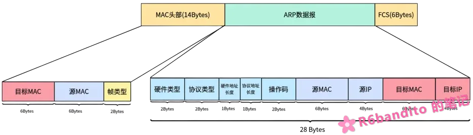
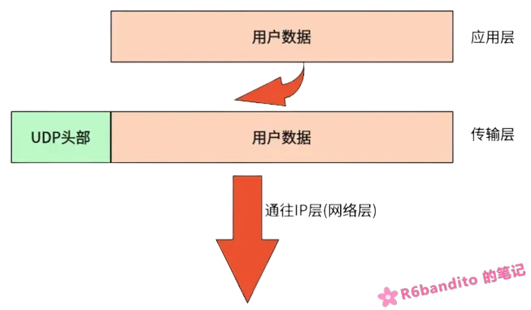
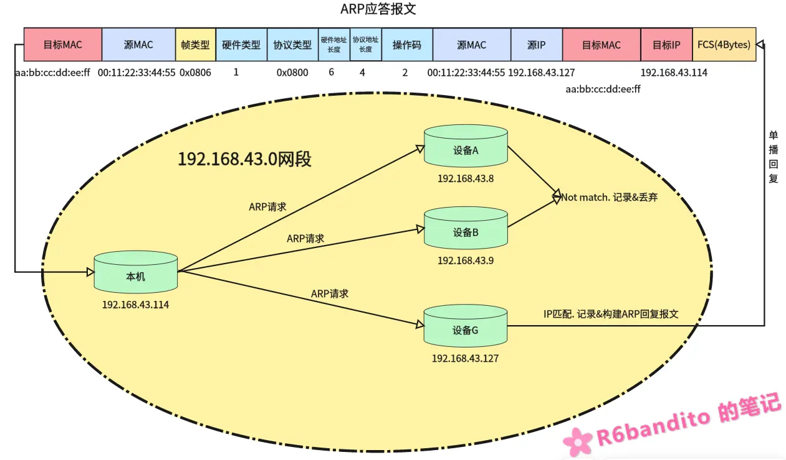

#### 前言

ARP全称为 **Address Resolution Protocol** 即地址解析协议。我们已经知道，IP网络中有IP地址这一概念。但是需要明白，在以太网环境中，数据帧在以太网上传输靠的是MAC地址，而IP只是逻辑地址负责逐跳传输。数据帧在传输过程中，不仅需要填上IP，还需要填上MAC地址才能正确在网络环境中路由。

那么在这个流程下，就会出现这样一个问题：**我们知道对端的IP地址，但是不知道MAC地址，IP层在组帧的时候没有MAC组不了，自然这帧数据就无法通过网卡被发送出去**。为了解决这个问题，我们就引入了ARP协议。

ARP协议的本质其实就是：**通过IP逻辑地址来解析出设备的物理MAC地址**。

------

#### ARP协议简介

了解ARP，首先得弄清楚其所处的位置。在通常情况下，我们可以认为ARP位于TCP/IP四层经典模型（详见）的网络层，与IP协议并列。

当我们在局域网中进行通信时，拿到的是目标主机的IP地址，但是IP只是逻辑地址，**下层在通信时使用的是MAC地址**。因此为了保证下一跳能够跳转到正确地址，IP层就会通过ARP协议获得对端的正确MAC地址，进而填入数据包发给下层去路由。

这里要提前说明一下：**ARP协议只适用于同一网段**，若两台设备位于不同网段，则不能够直接进行交互，需要交由网关进行代劳。

------

##### ARP报文格式

ARP报文格式如下图所示



（**勘误：图中FCS校验部分实际应为4字节，图中笔误写成了6字节，下同**）

报文中各数据区含义定义如下：

| 字段         | 长度   | 说明                         |
| :----------- | :----- | :--------------------------- |
| 硬件类型     | 2 字节 | 以太网为 1                   |
| 协议类型     | 2 字节 | IPv4 为 0x0800               |
| 硬件地址长度 | 1 字节 | MAC 地址长度，6              |
| 协议地址长度 | 1 字节 | IP 地址长度，4               |
| 操作码       | 2 字节 | 1=请求，2=应答               |
| 发送方 MAC   | 6 字节 | 请求方的 MAC                 |
| 发送方 IP    | 4 字节 | 请求方的 IP                  |
| 目标 MAC     | 6 字节 | 请求时填 0，应答时填对方 MAC |
| 目标 IP      | 4 字节 | 要解析的目标 IP              |

这里要注意一下，IP协议与ARP协议是并列的，所以ARP协议的报文直接封装在以太网帧中，而不是像ICMP一样封装在IP数据报中。

以太网帧头部的帧类型：`0x0800` 为IP数据包；`0x0806` 为ARP数据包。在ARP通信中均为`0x0806`表示该包数据包为ARP包，请协议栈按照ARP的格式进行解析和应答。

在以太网帧头中有一个目标MAC地址，在ARP数据报中也有一个目标MAC地址，这两个地址是不一样的，注意区分！在ARP请求时，以太网帧的目标MAC会填充为`FF:FF:FF:FF:FF:FF`，即广播地址。而ARP数据报中的目标MAC以0做占位；ARP回复时ARP应答数据报中的源MAC会被替换为所查询IP设备的物理MAC。这里先提前了解下，后续在讲述ARP流程时会详细阐述。

------

##### ARP工作流程

这里先引入一个情景：我们处于 `192.168.43.0` 网段，设备本机IP为 `192.168.43.114`，MAC地址为 `aa:bb:cc:dd:ee:ff`。在该网段中也存在一台设备G，其IP地址为 `192.168.43.127`，MAC地址为 `00:11:22:33:44:55`。

当我们要向设备G发送一段UDP数据报时，其流程如下：

- **待发数据在传输层打上UDP头部，派发到网络层**。



- **UDP报文进入IP层后，IP在对其进行封装IP数据包时发现对端MAC地址未知，暂时挂起发送请求，并请求一次ARP响应**。此时，ARP流程正式开始。

协议栈构建一帧ARP报文，将自己的MAC和IP填入到“源MAC”与“源IP”中，并将目标IP填入。对于目标MAC，用0占位。随后将以太网帧头部的MAC硬编码为 `FF:FF:FF:FF:FF:FF` 广播地址，通过网卡发送出去。具体如下图：


**为什么ARP请求要发广播地址**？

我们发起ARP请求目的是查询指定IP的MAC地址，因此必须发广播保证该网段下所有设备都能够收到，否则就失去了查询的意义。这里需要注意的是，这个广播只是本地网段广播，不会也不应该被网关转发。

- **该网段中所有设备都收到该ARP请求帧，并判断自身是否是被请求IP。如果不是，则记录下发送方的IP和MAC后丢弃该包（这里涉及ARP学习，于下文展开）；如果自身就是被请求IP，则记录发送方后构建ARP应答包回复**。



如上图所示，设备A、B收到ARP请求后，发现请求IP并非自己，于是记录发送方后丢弃；设备G收到ARP请求后，发现请求的IP正是自己，于是将请求方的MAC和IP记录下来，同时自身构建一帧ARP应答报文（操作码为2），并正确填入双方信息后单播回我们本机。

- **本机接收到ARP应答包，交给协议栈ARP处理分支进行处理，将目标设备的MAC从数据报中提取出来放入ARP缓存表**。
- **现在我们本机已经有了目标IP设备的物理MAC地址，解挂之前的UDP数据报，正式封装发送**。

以上就是一个常规的ARP查询流程。

------

##### ARP缓存表

当然，如果每发一次数据都要ARP广播找一次设备，那效率就太低了。为了解决这个问题，我们可以很自然的想到将对方的MAC永久记录下来，这样下次直接查表就可以了。但是这又引入了另一个问题：如果表项固定，那么意味着我们每和一台设备通信，就会在内存中记录下该设备。在真正的网络环境中，拓扑往往是比较复杂的，这就意味着我们设备需要花费大量内存空间来存储每一个通信设备的MAC表项。而且设备在网络环境中MAC是可以被修改的，假如同一台设备MAC变了，那按照原表去查到的是旧MAC，那么发送出去的数据包直接就丢在网络环境中了。种种这些都是要解决的问题。

针对这种情况，协议提供了**ARP缓存表**这一结构。接下来我将以LwIP的实现为例进行阐述。

###### 表项结构

ARP缓存表结构本质上是一个C结构体，以下是LwIP中ARP缓存表结构：

```c
struct etharp_entry {
#if ARP_QUEUEING
    struct etharp_q_entry *q;   /* 挂起的待发数据包队列 */
#endif
    ip4_addr_t ipaddr;          /* 目标 IP 地址 */
    struct netif *netif;        /* 从哪个网卡可以到达目标 */
    struct eth_addr ethaddr;    /* 目标 MAC 地址 */
    u16_t ctime;                /* 存活时间，用于老化 */
    u8_t  state;                /* 表项状态 */
};
```

通常，ARP缓存表一个表项的结构应当包含如下字段：

- **IP地址(ipaddr)**：该条表项对应的是哪个IP的MAC映射？
- **MAC地址(ethaddr)**：表项的核心，表示该IP设备对应的MAC地址。
- **类型**：ARP缓存表分为静态类型和动态类型，该字段用于指明该条表项的来源（手动静态配置的/学习到的）。
- **表项老化时间(ctime)**：表项清扫时间。这里要明白，内存就那么多（尤其是在嵌入式系统中），我们不可能让大量表项常驻在内存中，必须定时对旧的不活跃的连接进行清扫，释放内存。而清扫动作的根据就是表项老化时间。
- **网络接口(netif)**：记录该表项对应的对端设备通过哪个网卡可以到达。

这里你会发现LwIP的实现中并没有类型(type)字段，却多了一个`state`字段。其实LwIP内部是维护了一个状态机的，而“类型”作为其中一个状态被融合进了里面。关于LwIP的ARP状态机，本篇文章不展开说明。

------

###### 动态表项与表项老化

缓存表分为了**动态表项**和**静态表项**，动态表项一个最大的特征就是具备表项老化的机制。

缓存表老化本质上就是：**给每条ARP表项设定了一个生命周期，该周期通过每次通信进行重置。当该生命周期超时后将会被降级重新验证或删除以释放空间**。

缓存表老化是维护系统稳健性的一个关键举措：在网络环境中MAC和IP是可能发生变化的（比如更换网卡/IP给另一台设备），而且每个设备自身的内存空间都是有限的。如果表项一直不老化，那么表项越积越多，新旧混杂，占用空间越来越大，将导致内存枯竭或网络帧错误路由。

**缓存表老化流程**：

- 当我们通过ARP广播与一台设备建联时，此时ARP缓存表中该表项被正式建立并可用。此时协议栈内部会启动一个定时器记录从此刻开始的老化时间。
- 在这个老化时间计数期间，若双方再次发生通信，则老化时间被重置（这是符合预期的，表示对端活跃在线，自然要重置老化时间），重新进行计数；若在此期间未发生通信，则定时器继续计数。
- 若老化定时器超时，则该条表项将从就绪状态（`STABLE`）被撤下，转为待验证状态（状态改为`STABLE_REREQUESTING`）。此时，LwIP协议栈会立即广播一个ARP请求等待对方应答。若重复几次对方都无应答，则立即删除该表项并释放内存。

这里要说明一点：上述流程我们是采用LwIP的视角来叙述其行为的，然而在Linux这些现代系统中，其行为略有差异。在Linux中，老化定时器超时后表项状态将由 `REACHABLE` 变为 `STALE`，此时Linux并不会像LwIP一样广播ARP，而是继续维护`STALE`状态，并维护一个stale超时时间，当stale再次超时时该表项将会被删除。在`STALE`期间，若仍有数据需要发送，内核不会挂起数据等待验证结果，而是先把数据照常发出，同时启动一个短暂的验证窗口（详见下文）。

更重要的一点是：Linux 在验证机制上比 LwIP 更机智——`STALE` 表项并不会被周期性地主动保活，只有当它**再次被使用**（也就是"恰好有数据要发往这个邻居"）时，内核才会启动验证流程，而且验证的第一步甚至不需要发 ARP：

1. 状态先由 `STALE` 转为 `DELAY`，数据包照常发出；内核在默认 5 秒的窗口内等待"上层反馈"；
2. 若窗口内上层协议给出了可达性确认（典型如 TCP 收到了对方的 ACK），内核直接认定该表项仍然 `REACHABLE`——**一个 ARP 包都不需要发**；
3. 若窗口内没有任何确认，状态转为 `PROBE`，此时内核才主动发出**单播ARP请求**去探测对端，收到正确应答后恢复为 `REACHABLE`；连续探测失败则标记为不可达并最终回收。

这里还有一个容易忽略的细节：**UDP流量触发验证时，必然走到第 3 步**。因为 UDP 天生没有确认机制，5 秒窗口内不可能等到"上层反馈"，所以内核只能老老实实发 ARP 探测。

而 `STALE` 条目本身的回收是在 GC 周期中完成的：一段时间内没有被使用过的条目会被直接删除；若近期被使用过，则只会刷新其时间戳，使其继续存活。下面这条抓包记录就是一次 `PROBE` 探测的过程：

```c
17:18:09.143971 00:15:5d:e6:af:b7 > 00:15:5d:e6:fc:69, ethertype ARP (0x0806), length 42: Request who-has 172.18.224.1 tell 172.18.228.235, length 28
    
17:18:09.144126 00:15:5d:e6:fc:69 > 00:15:5d:e6:af:b7, ethertype ARP (0x0806), length 42: Reply 172.18.224.1 is-at 00:15:5d:e6:fc:69, length 28
```

可以看到，该记录正是一次 `PROBE` 探测：内核为验证该表项是否仍然有效，主动向 `172.18.224.1` 发出了一个**单播** ARP 请求，对方也正确回复了 ARP 应答，此后该条目恢复为 `REACHABLE`。相比 LwIP 过期广播重问的做法，Linux 这种策略更节省局域网带宽。

下面再来看一次完整的实测。实验里我们清空ARP表后先 ping 一次网关把表项建立起来，随后不再做任何操作，静置等待表项自然老化。期间系统后台进行了一次NTP校时（一次典型的UDP流量），恰好触发了上面这套验证流程：

```c
// 抓包视角（时间戳为与上一行的间隔）
+18.236899  172.18.228.235.35583 > 185.125.190.122.123: NTPv4, Client, length 188
            // NTP 请求发出（此时表项为 STALE，转发时随即转入 DELAY）
+0.189621   185.125.190.122.123 > 172.18.228.235.35583: NTPv4, Server, length 188
            // NTP 应答到达（UDP 无确认机制，DELAY 窗口不会因此提前结束）
+4.823691   00:15:5d:e6:fc:69 > 00:15:5d:e6:af:b7, ethertype ARP: Request who-has 172.18.228.235
            // 网关也向我们发了一个 ARP 请求（网关侧行为，与本机验证流程无关）
+0.000015   00:15:5d:e6:af:b7 > 00:15:5d:e6:fc:69, ethertype ARP: Reply
            // 我们回复网关
+0.117068   00:15:5d:e6:af:b7 > 00:15:5d:e6:fc:69, ethertype ARP: Request who-has 172.18.224.1
            // DELAY 窗口超时转入 PROBE，向网关发出单播 ARP 请求
+0.000158   00:15:5d:e6:fc:69 > 00:15:5d:e6:af:b7, ethertype ARP: Reply
            // 网关回复，探测完成
```

```c
// 状态视角（ip neigh show 逐秒采样）
19:35:44  172.18.224.1 dev eth0 lladdr 00:15:5d:e6:fc:69 STALE
19:35:47  172.18.224.1 dev eth0 lladdr 00:15:5d:e6:fc:69 DELAY       // NTP 请求触发验证
19:35:52  172.18.224.1 dev eth0 lladdr 00:15:5d:e6:fc:69 REACHABLE   // 探测成功，恢复就绪
```

可以看到，从NTP请求发出到单播ARP出现，前后恰好间隔约 5 秒，状态机完整走了一圈 `STALE → DELAY → PROBE → REACHABLE`。这里还有一个特别容易误判的点：由于 5 秒后 PROBE 一发即中，`PROBE` 状态只存在极短的一瞬间，逐秒采样时甚至完全看不到它。如果只看结果，很容易产生"内核在 STALE 很久之后突然自己发 ARP 保活"的错觉——实际上触发它的，往往只是后台一个不起眼的周期性UDP流量（如NTP、SSDP等），并不是内核在主动保活。

当ARP缓存表已满，但是又需要插入新表项时，会优先淘汰需要验证（也就是已经超时待验证的）表项。若所有表项均处于就绪状态时，则按LRU规则，以ctime老化时间为根据淘汰最旧的动态表项。

------

###### 静态表项

