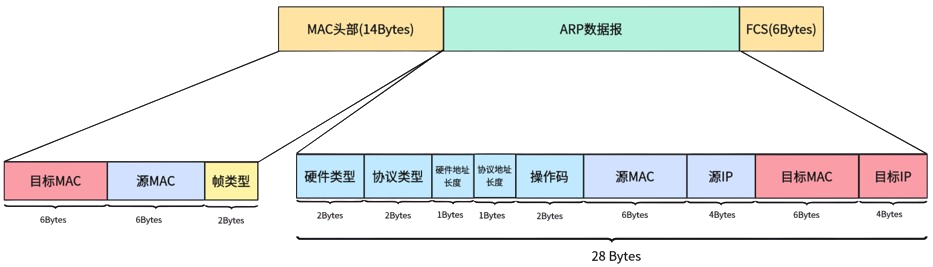
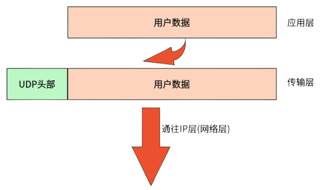
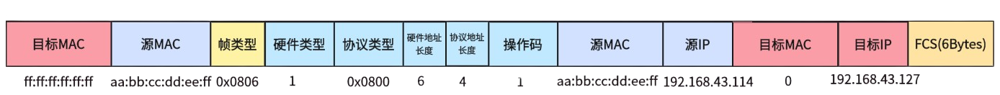
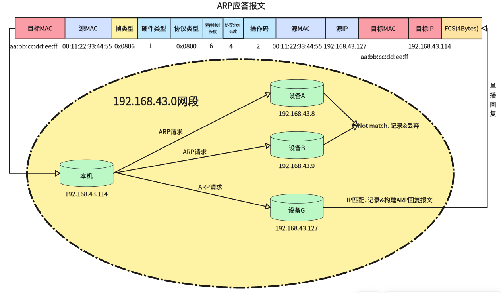

#### 前言

ARP全称为 **Address Resolution Protocol** 即地址解析协议。我们已经知道，IP网络中有IP地址这一概念。但是需要明白，在以太网环境中，数据帧在以太网上传输靠的是MAC地址，而IP只是逻辑地址负责逐跳传输。数据帧在传输过程中，不仅需要填上IP，还需要填上MAC地址才能正确在网络环境中路由。

那么在这个流程下，就会出现这样一个问题：**我们知道对端的IP地址，但是不知道MAC地址，IP层在组帧的时候没有MAC组不了，自然这帧数据就无法通过网卡被发送出去**。为了解决这个问题，我们就引入了ARP协议。

ARP协议的本质其实就是：**通过IP逻辑地址来解析出设备的物理MAC地址**。

------

#### ARP协议简介

了解ARP，首先得弄清楚其所处的位置。在通常情况下，我们可以认为ARP位于TCP/IP四层经典模型（详见）的网络层，与IP协议并列。

当我们在局域网中进行通信时，拿到的是目标主机的IP地址，但是IP只是逻辑地址，**下层在通信时使用的是MAC地址**。因此为了保证下一跳能够跳转到正确地址，IP层就会通过ARP协议获得对端的正确MAC地址，进而填入数据包发给下层去路由。

这里要提前说明一下：**ARP协议只适用于同一网段**，若两台设备位于不同网段，则不能够直接进行交互，需要交由网关进行代劳。

------

##### ARP报文格式

ARP报文格式如下图所示

（**勘误：图中FCS校验部分实际应为4字节，图中笔误写成了6字节，下同**）

报文中各数据区含义定义如下：

| 字段         | 长度   | 说明                         |
| :----------- | :----- | :--------------------------- |
| 硬件类型     | 2 字节 | 以太网为 1                   |
| 协议类型     | 2 字节 | IPv4 为 0x0800               |
| 硬件地址长度 | 1 字节 | MAC 地址长度，6              |
| 协议地址长度 | 1 字节 | IP 地址长度，4               |
| 操作码       | 2 字节 | 1=请求，2=应答               |
| 发送方 MAC   | 6 字节 | 请求方的 MAC                 |
| 发送方 IP    | 4 字节 | 请求方的 IP                  |
| 目标 MAC     | 6 字节 | 请求时填 0，应答时填对方 MAC |
| 目标 IP      | 4 字节 | 要解析的目标 IP              |

这里要注意一下，IP协议与ARP协议是并列的，所以ARP协议的报文直接封装在以太网帧中，而不是像ICMP一样封装在IP数据报中。

以太网帧头部的帧类型：`0x0800` 为IP数据包；`0x0806` 为ARP数据包。在ARP通信中均为`0x0806`表示该包数据包为ARP包，请协议栈按照ARP的格式进行解析和应答。

在以太网帧头中有一个目标MAC地址，在ARP数据报中也有一个目标MAC地址，这两个地址是不一样的，注意区分！在ARP请求时，以太网帧的目标MAC会填充为`FF:FF:FF:FF:FF:FF`，即广播地址。而ARP数据报中的目标MAC以0做占位；ARP回复时ARP数据报中的目标MAC会被替换为所查询IP设备的物理MAC。这里先提前了解下，后续在讲述ARP流程时会详细阐述。

------

##### ARP工作流程

这里先引入一个情景：我们处于 `192.168.43.0` 网段，设备本机IP为 `192.168.43.114`，MAC地址为 `aa:bb:cc:dd:ee:ff`。在该网段中也存在一台设备G，其IP地址为 `192.168.43.127`，MAC地址为 `00:11:22:33:44:55`。

当我们要向设备G发送一段UDP数据报时，其流程如下：

- **待发数据在传输层打上UDP头部，派发到网络层**。

- **UDP报文进入IP层后，IP在对其进行封装IP数据包时发现对端MAC地址未知，暂时挂起发送请求，并请求一次ARP响应**。此时，ARP流程正式开始。

协议栈构建一帧ARP报文，将自己的MAC和IP填入到“源MAC”与“源IP”中，并将目标IP填入。对于目标MAC，用0占位。随后将以太网帧头部的MAC硬编码为 `FF:FF:FF:FF:FF:FF` 广播地址，通过网卡发送出去。具体如下图：

**为什么ARP请求要发广播地址**？

我们发起ARP请求目的是查询指定IP的MAC地址，因此必须发广播保证该网段下所有设备都能够收到，否则就失去了查询的意义。这里需要注意的是，这个广播只是本地网段广播，不会也不应该被网关转发。

- **该网段中所有设备都收到该ARP请求帧，并判断自身是否是被请求IP。如果不是，则记录下发送方的IP和MAC后丢弃该包（这里涉及ARP学习，于下文展开）；如果自身就是被请求IP，则记录发送方后构建ARP应答包回复**。

如上图所示，设备A、B收到ARP请求后，发现请求IP并非自己，于是记录发送方后丢弃；设备G收到ARP请求后，发现请求的IP正是自己，于是将请求方的MAC和IP记录下来，同时自身构建一帧ARP应答报文（操作码为2），并正确填入双方信息后单播回我们本机。

- **本机接收到ARP应答包，交给协议栈ARP处理分支进行处理，将目标设备的MAC从数据报中提取出来放入ARP缓存表**。
- **现在我们本机已经有了目标IP设备的物理MAC地址，解挂之前的UDP数据报，正式封装发送**。

以上就是一个常规的ARP查询流程。

------

##### ARP缓存表

