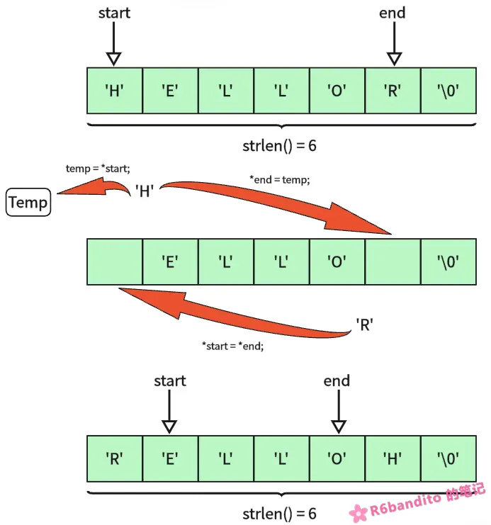
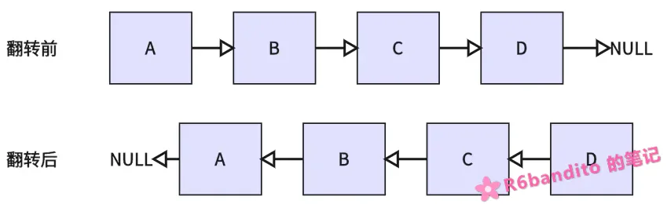
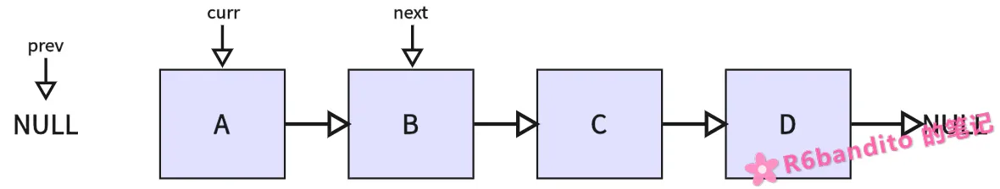
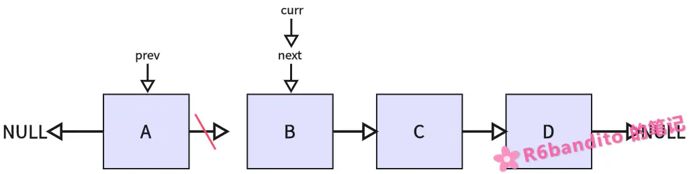
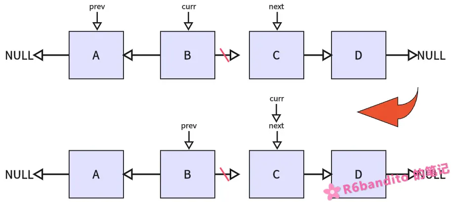
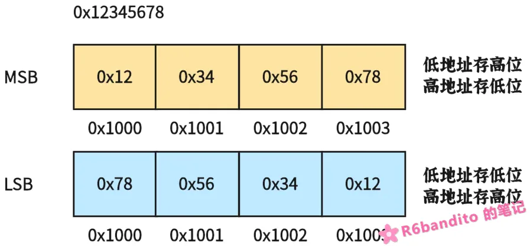
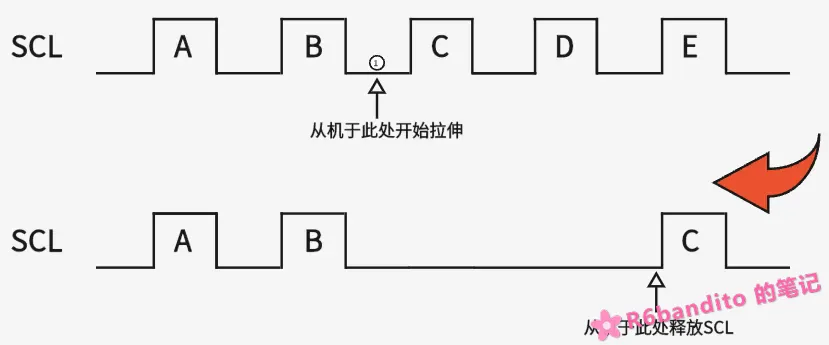

#### 前言

本偏文章主要用于记录一些自己平时看到的觉得不错的笔面试题目，虽然偏八股但是仔细研究一下还是能从里面学到不少门道的。长期随缘更新，题目顺序不固定，目前先线性往下慢慢写吧。文章可能难免会有缺陷，若您发现问题还望通过邮箱及时与我联系，帮助我及时改正，不胜感激。

------

#### 主目录

##### typdef int* INT_PTR; 和 #define INT_PTR int* 在声明多个变量时有什么不同？

这个题目有点意思，这里要清楚 #define 是宏替换，而 typedef 是类型重映射，这是二者的本质区别。看下面这个示例：

```c
typedef int* INT_PTR;
#define INT_PPTR int*

void 
test( void )
{
    INT_PTR a,b;	// a b 均为 INT_PTR 类型.
    INT_PPTR c,d;   // c 为 int*，d为int.
}
```

在IDE中写出上述示例，你查看变量类型会发现 a,b 均为 INT_PTR 类型；而 c 为 int* 类型，d 为 int 类型，二者很明显是有区别的。原因在于：在 #define 宏定义情况下，`INT_PPTR c,d;`被展开为了 `int* c,d;`，编译器将其理解为一个 int* c 变量和一个 d 变量（C语言中，声明变量若未显示指明类型则默认为 int 型）。因此才会出现c，d类型不一致的情况。

而在类型重映射情况下，`INT_PTR a,b;` 被编译器解释为了 `INT_PTR a, INT_PTR b;` 即 `int* a, int* b;`，因此二者都是同一个类型。

------

##### 什么是整数提升？unsigned char a = 0xFF; if( a == ~0x00 )这个条件成立吗？

首先，这个条件肯定是永远不会成立的。

这里涉及到C语言中一个类型运算规则：**在C语言中，只要是参与运算的参数类型小于int，那么会先将该类型提升到int或uint再参与运算**。而~0x00经过按位取反后，得到的结果应为`0xFFFFFFFF`，同时a经过提升变为`0x000000FF`参与比较，`0x000000FF` 很显然不等于 `0xFFFFFFFF`。因此这个条件永远是false。

------

##### 0x01 << 3 + 1 结果是多少？为什么？

嗯，很经典的一个问题，也很简单，考的是运算符优先级的问题。这里加法运算优先级高于位移优先级，因此实际等价于 `0x01 << (3 + 1) = 0x01 << 4 = 16` 。关于运算符优先级我这里不详细给出，只是强调一下：在实际运用中，如果不是很确定运算的优先级，那么请统一加括号，不要怕难看。哪怕是写成 `return (...(0x01 << (3 + 1))...)` 这样都没有问题，因为计算是明确的。

------

##### 定义一个结构，同一块内存访问能够存放4个字节数组，也能够作为32位整数访问，同时还支持按位访问。

很明显，同一块内存在不同情况下要搭建不同的内存模型，我们需要用到union联合体结构。

union联合体是一种C语言构造类型，**所有成员共享同一块内存空间，其大小等于最大成员的大小，用于在同一内存中存储不同类型的数据以节省空间**。这题相关结构定义如下所示：

```c
typedef union {
    uint8_t array[4];
    uint32_t var;
    struct {
        uint32_t bit0 : 1;
        uint32_t bit1 : 1;
        uint32_t bit2 : 1;
        ...
        uint32_t bit30: 1;
        uint32_t bit31: 1;
    } bits;
} MyStructure;
```

这里强调一下：位域这个结构可以详细了解下理论，但是少用。原因在于位域移植性很糟糕，在不同的字节序主机上同一套代码是完全不同的逻辑。因此在进行位操作时请使用相关操作符，而不是使用位域。

------

##### 字符串反转（不借助新数组，原地反转一个字符串）

```c
void 
reverse_string( char *str )
{
    if ( !str || strlen(str) < 2 ) return;

    char *start = str;
    char *end = str + strlen(str) - 1;

    while( start < end )
    {
        char temp = *start;
        *start = *end;
        *end = temp;

        start++;
        end--;
    }
}
```

这里不做过多讲解，直接给一轮流程图：



------

##### 模拟实现 strcpy 与 memcpy

my_strcpy:

```c
void 
my_strcpy( char *dest, const char *src )
{
    if ( !dest || !src )
        return;

    while( *src != '\0' )
        *dest++ = *src++;

    *dest = '\0';
}
```

my_memcpy:

```c
void 
my_memcpy( void *dest, const void *src, size_t n )
{
    if ( !dest || !src || n == 0 )
        return;

    uint8_t *d = (uint8_t *)dest;
    const uint8_t *s = (const uint8_t *)src;
    while( n-- )
        *d++ = *s++;
}
```

都是很简单的手写题，有个思路就行，不做过多讲解。

------

##### 冒泡排序

这里先简单讲讲冒泡排序的原理：

首先我们现在手上有一个待排无序数组`arr[5, 1, 7, 3, 2, 4]`。我们可以先在这6个数中，每两个数之间进行比较排序，将较大的数往后排。即：

> 1. 5和1比较：(5>1) ?  结果为True，5和1交换一次，原数组变为 arr[1, 5, 7, 3, 2, 4].
> 2. 再拿5和7比较：(5>7)? 结果为false，5和7不交换，数组保持不变.
> 3. 7和3比较：(7>3)? 结果为True，7和3交换一次，数组变为 arr[1, 5, 3, 7, 2, 4].
> 4. 7和2比较：(7>2)? 结果为True，7和2交换一次，数组变为 arr[1, 5, 3, 2, 7, 4].
> 5. 7和4比较：(7>4)? 结果为True，7和4交换一次，数组变为 arr[1, 5, 3, 2, 4, 7].

可以看到我们进行了5次比较，成功将整个序列中最大的数放到了最后。以上整个流程我们称之为一轮排序。既然经过一轮能选出一个最大的，那么我们下次排序剔除掉排好的这个，是不是又可以选出一个次最大的数据出来？最后，我们整个数组序列有6个元素，我们通过5轮排序，就能够将整个数组按从小到大的顺序进行序列化了。这就是冒泡排序的原理。以下是冒泡排序的参考程序实现：

```c
void 
bubble_sort( int *arr, int len )
{
    if ( !arr || len < 2 )
        return;

    /* 外层循环：排序轮数. */
    for( uint8_t i = 0; i < len - 1; i++ )
    {
        uint8_t isSwapped = 0;
        /* 内层循环：每轮需要的比较次数. */
        for( uint8_t j = 0; j < len - 1 - i; j++ )
        {
            if ( arr[j] > arr[j + 1] )
            {
                int temp = arr[j];
                arr[j] = arr[j + 1];
                arr[j + 1] = temp;
                isSwapped = 1;
            }
        }

        if ( !isSwapped )
            break;
    }
}
```

这里讲一下 `isSwapped` 这个标志位：这是个优化标志位，当我们给出的数组本来就是有序数组，或经过某轮排序后整体已经变为有序序列时，就没必要继续往下进行了。该标志位在数组已经有序后，其在下一轮的遍历流程中不会被置1（数组已经有序，不会再进行任何交换操作），此时检测到该标志位没有置1后，直接提前退出就可以了。

Ps：这里循环变量用的是u8，有溢出风险。此处只做演示说明，实际使用时根据具体情况来决定其类型。

------

##### 一些位操作相关逻辑

位操作算是嵌入式基本功了，此处给出一些位操作相关逻辑：

```c
/* 将 reg 的第 x 位置1. */
#define SET_BIT(reg, x)      ((reg) |= (0x01u << (x)))

/* 将 reg 的第 x 位清0. */ 
#define CLEAR_BIT(reg, x)    ((reg) &= (~(0x01u << (x))))

/* 读取 reg 的第 x 位. */
#define GET_BIT(reg, x)      (((reg) >> (x)) & 0x01u)

/* 翻转 reg 的第 x 位. */
#define TOGGLE_BIT(reg, x)   ((reg) ^= (0x01u << (x)))
```


“统计一个字节里面有多少个1” 这是一道非常经典的笔试题目，一个很简单的位移使用，我曾今也碰到过：

```c
uint8_t 
count_ones( uint8_t data )
{
    uint8_t count = 0;
    for( uint8_t i = 0; i < 8; i++ )
    {
        if ( (data & (0x01 << i)) )
            count++;
    }

    return count;
}
```

这是我曾经的写法，不能说是错的，但是还有一种更巧妙的写法：

```c
uint8_t 
count_ones( uint8_t data )
{
    uint8_t count = 0;
    while( data > 0 )
    {
        data &= (data - 1);
        count++;
    }

    return count;
}
```

怎么样？不管data是什么数，`data & (data - 1)` 总能够把data最低位的一个1去丢。

例如`data = 0b1101 1010`、`data - 1 = 0b1101 1001` 。`data & (data - 1) = 0b1101 1000` 看到没？经过一次操作将其最低的一个1去掉了，此时`count=1`。继续while循环直到`data = 0`，刚好把5个1全部去掉，`count=5`，这不就统计出来了吗？ 这个方法比较巧妙，后续求一个数是否是2的幂等数时，也会用到类似的思想。

------

##### 单链表反转

单链表反转也是个比较经典的考点，这里用文字叙述有些不易理解，所以先以下图进行一个情景带入：



翻转前链表的头节点为A，我们要求链表翻转后D为头节点，A为尾节点。这里我们采用三指针法进行翻转：

- 定义三个指针 `curr`、`next`、`prev`。初始状态下，curr指向当前头节点，next与prev初始化为NULL。
- 将next指向`curr->next`。也就是用next记住当前curr节点的下一个节点，防止翻转curr后丢掉后继节点。



- 将curr当前节点翻转指向prev，并且同步更新prev和curr。



- 重复上述操作，将next指向curr的next，然后对curr指向节点进行翻转，并同步更新curr与prev。



- 一直循环该翻转操作，直到最后一个节点D也成功翻转，变为头节点。

下列是三指针法进行单链表翻转的参考示例：

```c
typedef struct Node Node;
struct Node {
    uint8_t data;
    Node *next;
};

Node *
list_reverse( Node *head )
{
    if ( !head )  return NULL;

    Node *curr = head;
    Node *next = NULL;
    Node *prev = NULL;

    while( curr != NULL )
    {
        next = curr->next;
        curr->next = prev;
        prev = curr;
        curr = next;
    }

    return prev;
}
```

------

##### 数组单次遍历找最大值和次大值

数组找最值并不复杂，核心点在于一次循环必须找出最大和次大值。这里我们的思路是在给定数组的前两个元素中，先找出暂定最大值，剩下一个作为暂定次大值。后续从数组的第三个元素开始向后遍历，若找到一个比当前最大值还要大的元素，则更新当前最大值，同时用旧的最大值来更新次大值；若找到一个大于当前次大值，却又小于最大值的元素，则只更新次大值。一轮循环过后成功拿到最大、次大值。

程序示例如下：

```c
void 
find_max_sec( int *arr, int len, int *Omax, int *Osec )
{
    if ( !arr || len < 2 )
        return;

    /* 先在前两个元素中暂定最大值与次大值. */
    int max = arr[0];
    int sec = arr[1];
    if ( max < sec )
    {
        int temp = max;
        max = sec;
        sec = temp;
    }

    /* 从第三个元素开始遍历. */
    for( uint32_t i = 2; i < len; i++ )
    {
        /* 找到比当前最大值还大的元素. 更新最大值与次大值. */
        if ( arr[i] > max )
        {
            sec = max;
            max = arr[i];
        }
        else if ( (arr[i] > sec) && (arr[i] != max) )
        {
            /* 找到大于次大值且小于最大值的元素. 仅更新次大值. */
            sec = arr[i];
        }
    }

    /* 一轮遍历结束. 根据参数进行结果输出. */
    if ( Omax ) *Omax = max;
    if ( Osec ) *Osec = sec;
}
```

------

##### 判断一个数是不是2的幂

判断一个数是否是2的幂等数，你可能会想：直接对2循环取余判断是否为0不就完了吗？这有啥难的？确实，不过我们这里要讲的是通过位操作来判断2的幂等数。通过位操作进行判断是一个经典的笔试题，同时也有确切的应用场景。你比如在环形缓冲区中我们进行优化时就会用到该方法（详见：）

```c
int 
is_power_of_two( uint32_t data )
{
    return ((data > 0) && (data & (data - 1)) == 0);
}
```

这里简单讲讲为什么2的幂等数能够使用 `data & (data - 1) == 0` 来判断：因为2的幂等数在2进制中只有一个1，例如`64(0b0100 0000)`、`128(0b1000 0000)` 。这些数减去1后会把那个1变成0，而把剩下的0变成1。比如 `128 - 1 = 127(0b0111 1111)`，这样两个一做与运算`data & (data - 1) = 0b1000 0000 & 0b0111 1111 = 0` 结果不就是0吗？

一条 `data & (data - 1)` 位运算在底层看来就是单纯一条指令，仅需一个时钟周期。而如果你采用循环取余的方式，由于底层没有专门的除法电路，其除法器通常是通过反复的减法、移位、试商等微码循环来实现的。这就意味着一条除法指令往往需要花费数十个时钟周期，还要涉及循环开销。这个性能帐我相信谁都能算明白。

------

##### #define SQUARE(x)   x*x，那么 SQUARE(2+3) 等于多少？

这是个很典型的带参宏定义陷阱题。我们首先需要清楚宏定义的本质：**在预处理阶段进行文本替换**。也就是说你丢在括号里面的这一个表达式会原封不动的通过宏定义进行文本更换。

```c
#define SQUARE(x)   x*x

SQUARE(2+3) -(宏定义展开)-> 2+3*2+3.
```

发现问题了吗？我们原意是计算`5*5 = 25`，结果宏定义展开后由于运算符优先级的作用，导致计算式变为了 `2+6+3 = 11` ，这就是带参宏定义很容易出现的问题。所以在进行宏定义时，入参必须写成如下形式：

```c
#define SQUARE(x)   ((x)*(x))
```

通过括号来保证运算有一个确定的优先级，而不受运算符优先级的影响。

------

##### 大小端字节序判断

字节序判断这个已经无需多言了，相信只要看过笔试整理相关文章的100%都能遇到。这里简单讲讲什么是大小端字节序并给出两种判断方法。

**大端字节序(MSB)**：多字节数据的高位字节存放在内存的低地址，低位字节存放在内存的高地址。例如 `0x12345678`这个32位数据存储在 0x1000 ~ 0x1003 这四个字节的位置。那么在MSB字节序下 0x1000 存的就是 0x12(高位字节)，对应的 0x1003存的就是 0x78(低位字节)。

**小端字节序(LSB)**：多字节数据在内存中低地址存放低位字节，高地址存放高位字节的存储方式（低地址存低位，高地址存高位）。还是以上述 `0x12345678` 为例，在LSB字节序下面 0x1000 存的是 0x78(低位字节)，对应的 0x1003存的是 0x12(高位字节)。

二者的内存布局如下图所示：



以下给出两种方法来判断当前环境字节序：

- 通过联合体(union)进行判断，这也是最为常见的一个方法。

```c
union {
    uint32_t data;
    uint8_t array[4];
} uio;

int 
check_endian( void )
{
    uio.data = 0x12345678ul;
    /* 返回 1 为MSB字节序；返回 0 为LSB字节序. */
    return ((uio.array[0] == 0x12) ? 1 : 0);
}
```

- 通过指针强转进行判断。

```c
int 
check_endian( void )
{
    uint32_t i = 1;
    /* 返回 1 为MSB字节序；返回 0 为LSB字节序. */
    return (((*(uint8_t *)&i) == 0) ? 1 : 0);
}
```

我们所使用的 `ARM Cortex-M` 架构就是典型的LSB字节序，而网络字节序是典型的MSB字节序。

------

##### I2C为什么需要上拉电阻？一般阻值为多大比较合适？

首先从I2C的架构方面来入手，I2C可以用来进行**多主多从**组网，在多主机情况下，I2C总线上谁控制住时钟SCL谁就是本次通信的主机。I2C总线有线与仲裁机制，所以就算多个主机同时进行通信，最终在仲裁机制下只会有一个设备得以成功与从机建立通信。而在这仲裁期间，假如我们使用推挽输出，那么当一个设备输出高电平1，另一个设备接地输出低电平0时，那么在总线上就会出现一个从 VCC 直接短路到 GND 的回路，这回产生一个瞬时大电流很容易会导致GPIO口被烧毁。

因此在I2C上我们必须使用开漏输出，这意味着高电平无法输出到总线，那么这个时候就需要一个显式的外部上拉来完成总线电平输出高这个动作，这就是为什么需要外部上拉电阻。

这个上拉电阻的阻值在 3.3V 系统中，我们通常采用4.7kΩ比较合适。这个上拉电阻的阻值不能过大，也不能太小

- 阻值过大的话由于RC电路特性，上升沿会变缓。若通信速率比较高的话很容易会出现在SCL还没充到高电平，SDA就可能已经被下拉到0了，导致通信误码、ACK丢失等问题。
- 阻值过小上升沿陡峭，适合较高速率的通信。但是同时总线上电流比较大，器件功耗大发热大，甚至如果电流超过了I2C器件的承载值的话可能会烧器件。

------

##### I2C时钟拉伸

正常情况下，I2C总线的时钟SCL是由主机控制的，但在某些情况下，由于主机通信速率过快从机处理不过来，部分从机会主动抓住SCL时钟线（从机拉低SCL），让主机无法继续产生时钟脉冲。从机处理完毕后再松开SCL，将SCL控制权交还给主机，继续进行接下来的通信。

**从机主动拽住SCL时钟线的这个机制就叫作I2C的时钟拉伸机制**。

这里以一个具体的时序例子来看看时钟拉伸：



正常情况下，主机将依次发出A、B、C、D、E五个脉冲，在脉冲高电平期间，SDA数据线被锁存，从机在高电平期间读取SDA数据线上的数据，这正是I2C总线的主机向从机写数据行为。

但是在①处，由于从机需要执行一些耗时操作（例如从机内部`E2PROM`写入行为），因此必须拽住SCL时钟，防止主机继续发送导致数据丢失、通信失败。

主机在经过B、C之间的数据建立时间后，主动释放时钟线想要让SCL被上拉到高电平进行数据采样。但是释放后主机发现SCL并没有按照预期升到高电平，于是推测目前有从机正在进行时钟拉伸动作，于是主机便等待并定时轮询SCL状态。

等到从机释放SCL后，后续通信流程正常进行。上述就是一次I2C时钟拉伸的流程。

这里我再强调下I2C时钟拉伸的时机：**时钟拉伸是发生在SCL低电平期间的！也就是时钟拉伸发生的同时主机也是在拉低SCL的**。从机不能够在SCL高电平期间拉低SCL!因为I2C中高电平是采样时间，如果从机提前拉低SCL会产生一个下降沿，相当于新产生了一个时钟边沿，破坏了主机时钟的完整性，会导致后续通信出问题！

------

##### 中断服务函数注意事项

中断ISR是硬实时上下文，阻塞中断会导致整个系统挂起，因此我们在编写ISR时要做到**快、短、安全、可重入**。

- 中断内部不要调用延时或阻塞相关的API，会严重破坏系统实时性。
- 中断内部不要调用不可重入API，标准C的`malloc`就是个典型例子，`malloc`是非线程安全的，假如主循环中某处`malloc`调用被ISR中断了，而在ISR中又调用`malloc`，很容易会导致堆结构损坏。
- 对于一些需要在中断中修改，主程序判断使用的全局变量，请加上`volatile`。因为编译器在编译主循环代码时是感知不到ISR的，因此在某些极端条件下会过度优化导致程序逻辑出错。加上`volatile`禁止编译器进行重排和缓存。
- 记得及时清除中断标志，正确做法是进入ISR后应首先清除标志再进行逻辑，否则可能会因为某些路径提前退出ISR或忘记清除标志导致无限ISR风暴。
- 注意栈空间。ISR上下文使用的是MSP主栈指针，是会累积压栈的。什么叫累积压栈？举个例子：
  当你从`main`中调用 `funcA()`，内部再调用`funcB()`时，你的调用栈是这样的：`main->funcA()->funcB()`。
  这一整个调用链上的每个函数的内核通用寄存器以及栈局部数据结构都是压在MSP上的(裸机示例)，此时`funcB()`被ISR中断，ISR的整个栈是直接接着MSP中的`funcB()`继续往后压的。如果你的栈已经在前续调用中被使用得差不多了，此时ISR压上来很可能会栈溢出。这是个比较隐蔽的问题，要注意。
- 中断中不要进行复杂的逻辑处理和运算。这一点可以和第一点归于一类，都违反了中断的快、短准则，会影响系统实时性。要利用好中断下半段处理，将耗时操作挪到中断后半段去（例如FreeRTOS，在PendSV中进行任务切换，这其实也是利用了中段下半部分的处理机制）。

------

##### I2C 死锁

