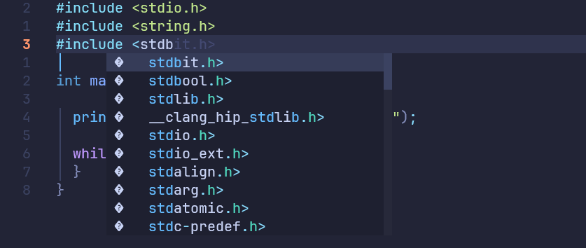

#### 现象及原因

环境: WSL2 + Ubuntu(26.04)。在环境中装好LazyVim插件后，发现编辑器的智能补全功能并不完善，C头文件以及相关函数不能够在补全菜单中显示。经查，是我系统虽然安装了`clangd`等前置，但LazyVim并不会直接使用系统里安装的工具，而是通过Mason包管理工具来链接外部工具。具体来说：LazyVim的默认策略是不直接启用这类语言服务器，而是把启用工作交给Mason系的组件；而Mason系只认自己安装的服务器。我的`clangd`是apt装在系统里的，Mason管理的指定位置里并没有它——两头都不认，所以尽管系统已经正确安装clangd，却谁都没有把它启用起来，该功能也就失效了。

#### 解决方法

- 首先应该确保在系统中正确安装开发环境：

```bash
gcc --version
make --version
ld --version
```

并补一条真实编译测试：

```bash
printf '#include <stdio.h>\nint main(void){return 0;}\n' > /tmp/t.c \
  && gcc /tmp/t.c -o /tmp/t.bin && /tmp/t.bin && echo "编译链 OK"
```

确保基础编译工具链已被正确安装，若未安装请使用以下命令装前置：

```bash
sudo apt update
sudo apt install -y build-essential
```

- 使用下列命令确保系统已安装clangd

  ```bash
  sudo apt install clangd
  ```

  这里简单讲讲什么是clangd：clangd本质是一个常驻的C/C++语义分析引擎服务，由LLVM开发，是编辑器实现智能补全的核心。在我们使用编辑器对源文件进行编辑时，clangd会在后台实时解析你的代码——做的事情和编译器的前半程一样（展开头文件与宏、构建语法树），但不产出可执行文件，而是通过这个过程获取你当前的代码结构。当你输入部分关键字(例如str)时，clangd会收集当前光标所处作用域内的所有可见符号（局部变量、参数、函数名，以及`#include`引入的声明），按前缀过滤后返回给编辑器。这也是为什么你在光标处输入str后，补全菜单会自动跳出 `strcmp`、`strcpy`等等符号。

- 前置全部正确安装之后，使用新增一个nvim的clangd.lua配置文件 `~/.config/nvim/lua/plugins/clangd.lua` 。在新创建的文件中将下列代码复制进去：

  ```lua
      return {
        {
          "neovim/nvim-lspconfig",
          opts = {
            servers = {
              clangd = { mason = false }, 
            },
          },
        },
      }
  ```

  这段代码的含义是告诉LazyVim：clangd这个语言服务器不走Mason管理，直接使用本机系统已经装好的clangd。

- 用LazyVim打开一个源文件，可见自动补全已经正常运行（也可以用`:LspInfo`查看clangd是否处于attached状态）：

  

------

#### 关于智能补全

这里简单来聊聊LazyVim的智能补全机制，究竟是怎么做到智能补全的。首先得清楚：LazyVim本质上不是编辑器，而是针对Neovim打造的一套个性化配置。我们在使用编辑器时，用的是Neovim，而各种个性化以及智能化配置是由LazyVim配置而来的。

Neovim内置了LSP客户端，LSP是语言服务器协议，用于编辑器与语义分析服务(比如我们的clangd)之间的桥梁。其整个智能补全的简单工作流程如下：

- 我们在编辑器中输入s-t-r三个字符，LSP会向clangd服务发送一条JSON信息，这条信息中包含文件路径和当前光标位置。注意，这里并不包含我们输入的内容——clangd会自己从文件内容里读取光标前的文本，提取出我们正在输入的词。
- clangd收到信息后，定位到当前光标位置，并且收集所有可见的相关符号，过滤后返回给LSP。LSP收到后返回给上层服务进行综合排序，排序完毕后通过菜单呈现出来。这就是我们看到的智能补全菜单了。
